# 01 · Acceso, roles y seguridad (módulo 001)

**Quién lo usa:** todo el personal del backoffice. **Estado:** disponible desde la etapa 1 (15/09/2026): ingreso con verificación en dos pasos, roles, administración de usuarios, bitácora y cuenta propia. El indicador de servidor funciona desde la etapa 0.

> Las capturas son de un entorno de prueba, con usuarios y datos ficticios.

## Resumen

- Todo el backoffice (`/admin`) exige iniciar sesión. El sitio público (catálogo, ficha del vehículo, simulador y solicitud de crédito) sigue abierto a cualquier visitante.
- Cada persona entra con **su propio** usuario, su contraseña y un código de 6 dígitos que genera su teléfono: la verificación en dos pasos (2FA). No usa mensajes de texto ni tiene costo (D-04).
- Lo que cada persona ve y puede hacer depende de sus **roles**.
- Lo importante queda en la **bitácora**, que nadie puede modificar ni borrar.

## Roles del backoffice

Los roles son los de la decisión D-03, y lo que permite cada uno se aprobó en D-24. Una persona puede tener varios roles, y sus permisos se suman.

| Rol | Para qué existe | Secciones que ve en el menú |
|---|---|---|
| Administrador | Gestiona usuarios y roles, y la configuración de la plataforma | Inventario (solo consulta), Usuarios y Bitácora |
| Asesor comercial | Atiende a las personas y lleva sus oportunidades: citas, contactos y ventas | Inventario (consulta), Citas y Solicitudes, Embudo Comercial, Personas y Cotizador Crédito |
| Coordinador comercial | Supervisa el embudo y reparte las oportunidades entre asesores | Las mismas que el asesor; ve todas las oportunidades, no solo las suyas |
| Inventario | Da de alta y mantiene los vehículos, sus fotos e imperfecciones | Inventario, con alta y edición |
| Analista de crédito | Revisa las solicitudes de crédito y sus recaudos | Inventario (consulta) y Cotizador Crédito. La bandeja de crédito llega en la etapa 4 |
| Auditor | Consulta sin modificar nada | Inventario, Citas y Solicitudes, Embudo, Personas y Bitácora, todo en consulta |

**El administrador no opera el inventario, el CRM ni el crédito** (Principio I de la Constitución). Si una persona administra y además vende, se le asignan los dos roles.

Matriz completa de permisos:

| Permiso | Administrador | Asesor | Coordinador | Inventario | Analista de crédito | Auditor |
|---|:-:|:-:|:-:|:-:|:-:|:-:|
| Gestionar usuarios y roles | ✔ | | | | | |
| Consultar la bitácora | ✔ | | | | | ✔ |
| Editar los parámetros de financiamiento (etapa 4) | ✔ | | | | | |
| Registrar la tasa BCV (etapa 2) | ✔ | | | | ✔ | |
| Ver el inventario | ✔ | ✔ | ✔ | ✔ | ✔ | ✔ |
| Gestionar el inventario | | | | ✔ | | |
| Ver sus oportunidades y las sin asignar | | ✔ | | | | |
| Ver todas las oportunidades | | | ✔ | | | ✔ |
| Operar citas, contactos, etapas y ventas | | ✔ | ✔ | | | |
| Asignar oportunidades | | | ✔ | | | |
| Usar el cotizador | | ✔ | ✔ | | ✔ | |
| Revisar solicitudes de crédito (etapa 4) | | | | | ✔ | |
| Ver solicitudes de crédito | | | | | ✔ | ✔ |

> **En esta etapa**, el inventario y el CRM siguen guardándose en el navegador y pasan al servidor en las etapas 2 y 3. Hoy los roles deciden qué secciones ve cada persona, y el alta y la edición de vehículos ya exigen el rol Inventario. Los demás permisos de cada pantalla se aplican cuando esa pantalla pase al servidor.

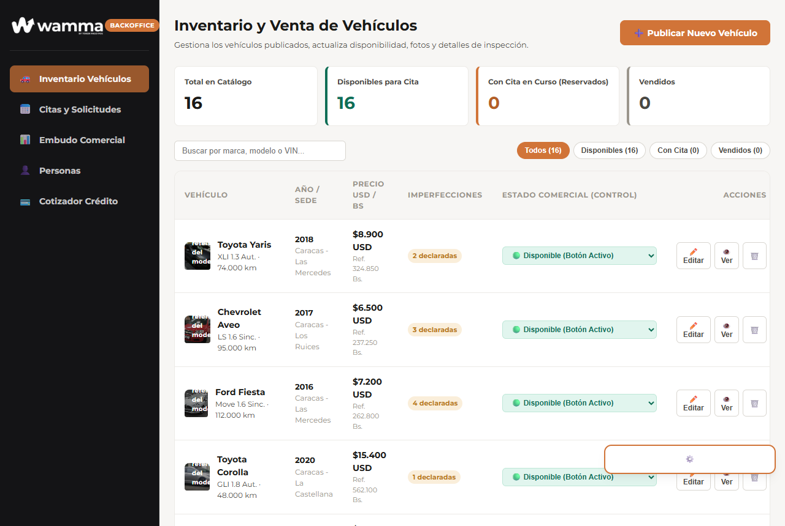

## Primer ingreso

1. Un administrador te da de alta y te entrega tu **usuario** y una **contraseña temporal**, en persona o por teléfono.
2. Abre el backoffice (`/admin`). Aparece **Ingresa al backoffice**: escribe tu usuario y la contraseña temporal, y pulsa **Ingresar**.

   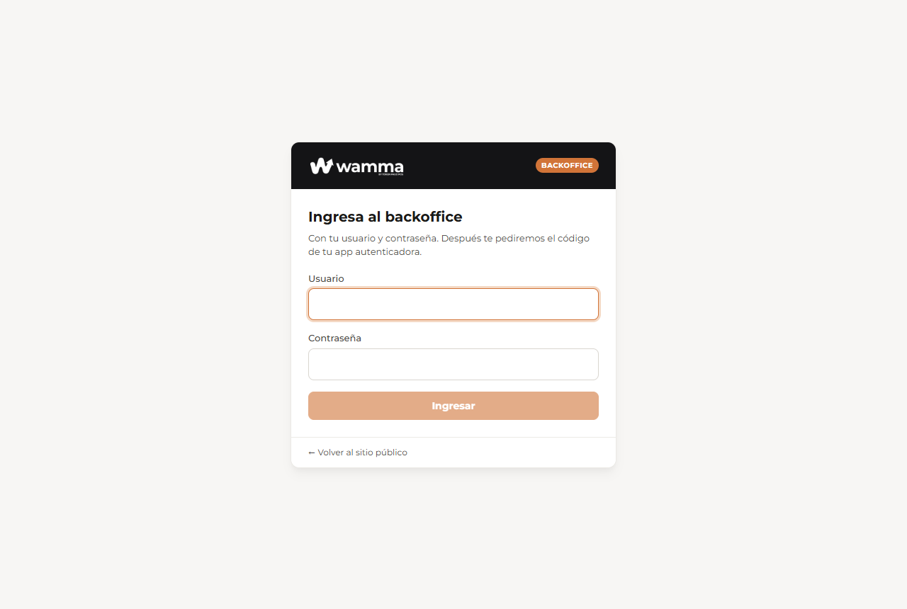

3. **Crea tu contraseña.** Debe tener al menos 12 caracteres; una frase fácil de recordar funciona bien. No puede contener tu usuario ni ser una contraseña común. Escríbela dos veces y pulsa **Guardar contraseña**.

   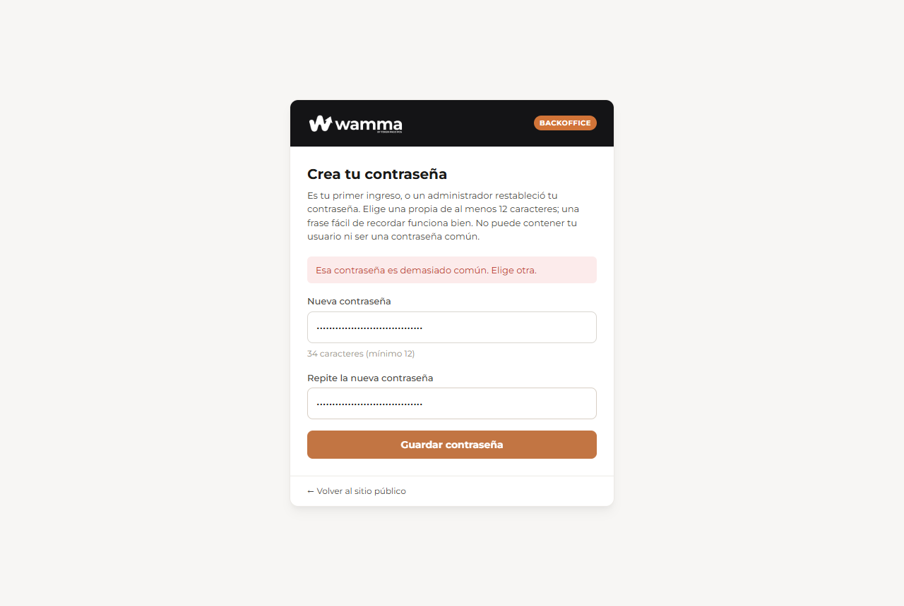

4. **Activa la verificación en dos pasos.**
   - Abre en tu teléfono una app autenticadora: Google Authenticator, Microsoft Authenticator, Authy u otra compatible. Si no tienes ninguna, instálala desde la tienda del teléfono.
   - En la app, agrega una cuenta y escanea el código QR. Si no puedes escanearlo, elige "introducir clave" y escribe la clave que aparece debajo del código.
   - La app mostrará **WAMMA** con un código de 6 dígitos que cambia cada 30 segundos. Escríbelo y pulsa **Activar y continuar**.

   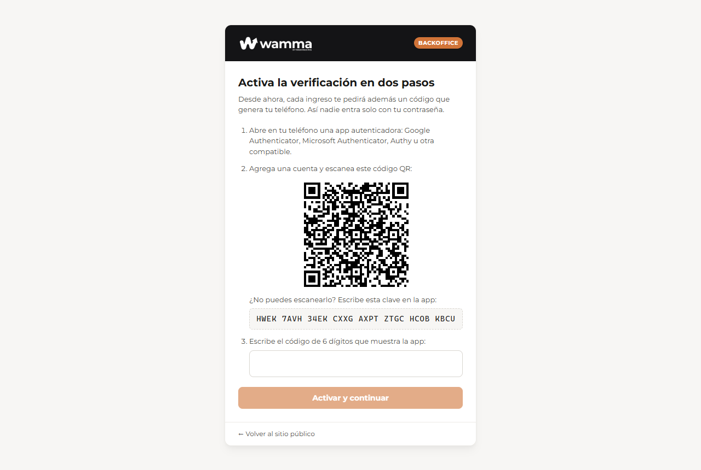

5. **Guarda tus códigos de recuperación.** Son 10 códigos, y cada uno te deja entrar **una sola vez** si pierdes el teléfono. Pulsa **Copiar** o **Descargar (.txt)** y guárdalos fuera del equipo: impresos o en un gestor de contraseñas. **No volverás a verlos.** Marca **Guardé los códigos en un lugar seguro** y pulsa **Entrar al backoffice**.

   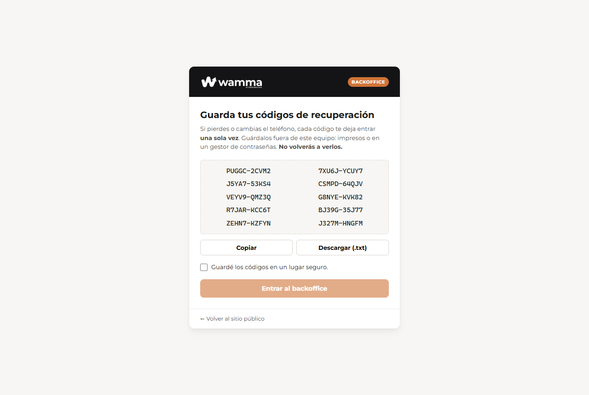

6. Entras a la primera sección que tu rol permite. Si habías abierto un enlace del backoffice antes de ingresar, vuelves a esa página.

Desde que escribes la contraseña tienes **5 minutos** para completar los pasos. Si pasan, la pantalla te pide empezar de nuevo.

## Ingresos siguientes

1. Escribe tu usuario y tu contraseña.
2. Escribe el código de 6 dígitos que muestra la app en ese momento y pulsa **Verificar**.

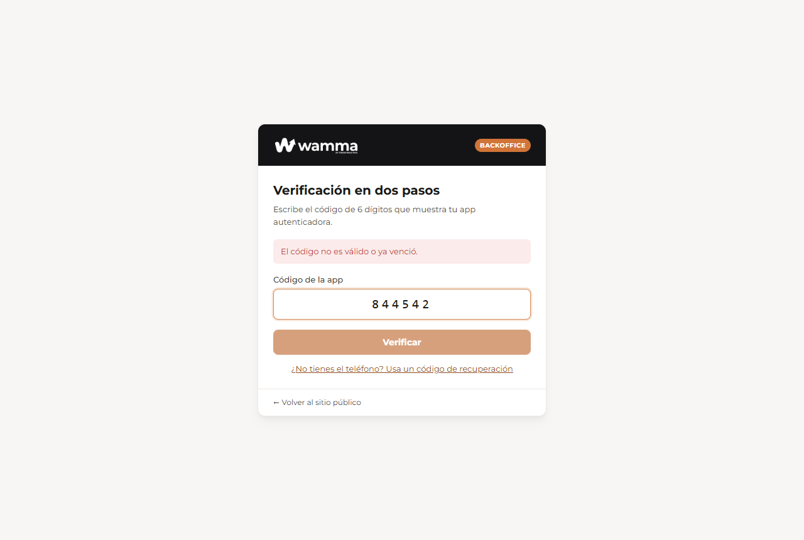

Cada código sirve **una sola vez**. Si acabas de usar uno (por ejemplo, al salir y volver a entrar enseguida), espera a que la app muestre el siguiente. Si los códigos nunca funcionan, revisa que el teléfono tenga la hora automática.

## Si pierdes o cambias el teléfono

- En el paso del código, pulsa **¿No tienes el teléfono? Usa un código de recuperación** y escribe uno de tus 10 códigos. Da igual si lo escribes en mayúsculas o minúsculas, y el guion es opcional.
- Después de usarlo, la plataforma te pide **registrar de nuevo tu app autenticadora** y te entrega 10 códigos nuevos. Los anteriores dejan de servir.
- Si ya no tienes códigos, pide a un administrador que **restablezca tu 2FA**. En tu siguiente ingreso lo registrarás de nuevo.

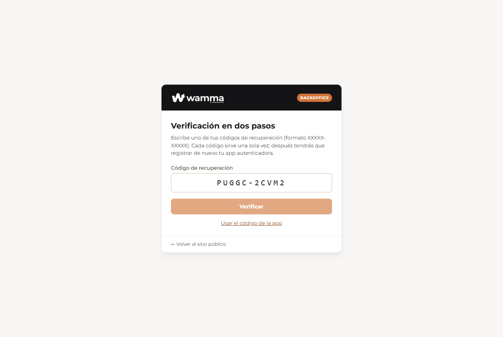

## Tu sesión

- **Vence tras 30 minutos sin actividad** y, en cualquier caso, **a las 12 horas**. Al vencer, la pantalla de ingreso explica por qué.
- **Vive solo en la pestaña donde ingresaste.** Al cerrarla, la sesión se olvida. Otra pestaña o ventana pide ingresar de nuevo.
- **Cerrar sesión:** botón en la parte de abajo de la barra lateral, junto a tu nombre.
- Si un administrador te desactiva, o restablece tu contraseña o tu 2FA, tu sesión termina en ese momento. Lo notarás al recargar la página o, como mucho, en 5 minutos.

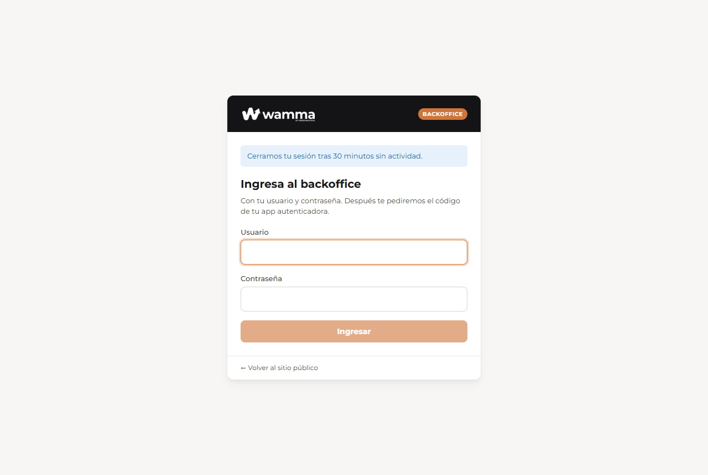

## Mi cuenta

En la barra lateral, **Mi cuenta** muestra tus datos, tus roles y lo que puedes hacer. Ahí también se cambia la contraseña: escribe la actual y dos veces la nueva. Al cambiarla, se cierran tus otras sesiones abiertas.

Para corregir tu nombre o tu correo, pide ayuda a un administrador.

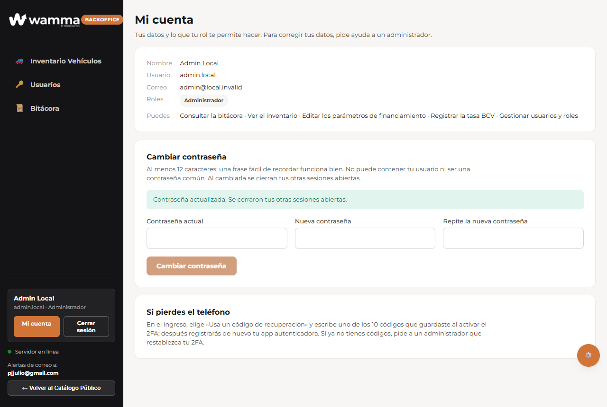

## Administrar usuarios (rol Administrador)

Sección **Usuarios** del backoffice.

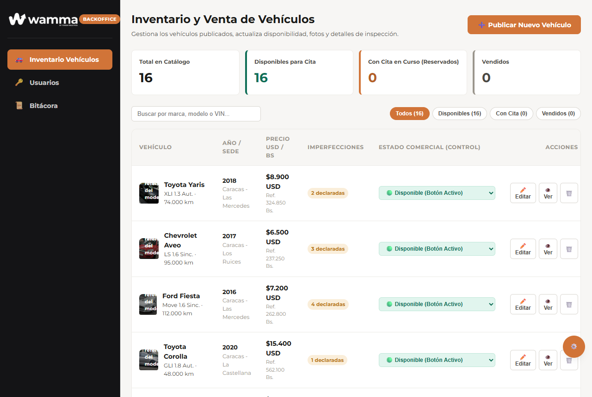

### Dar de alta a una persona

1. Pulsa **+ Nuevo usuario**.
2. Completa usuario, correo, nombre y apellido, y marca al menos un rol. Cada rol muestra lo que permite.
   - El **usuario** tiene de 3 a 50 caracteres: letras minúsculas, números, punto, guion o guion bajo. Con él se ingresa y **no se puede cambiar** después.
   - Usuario y correo no pueden repetirse.
3. Pulsa **Crear usuario**. La plataforma muestra una **contraseña temporal una sola vez**. Entrégala por un canal seguro, de preferencia en persona o por teléfono. Si se pierde, restablécela.
4. En su primer ingreso, la persona elige su contraseña y activa el 2FA. Hasta entonces, la lista muestra su 2FA como **Pendiente**.

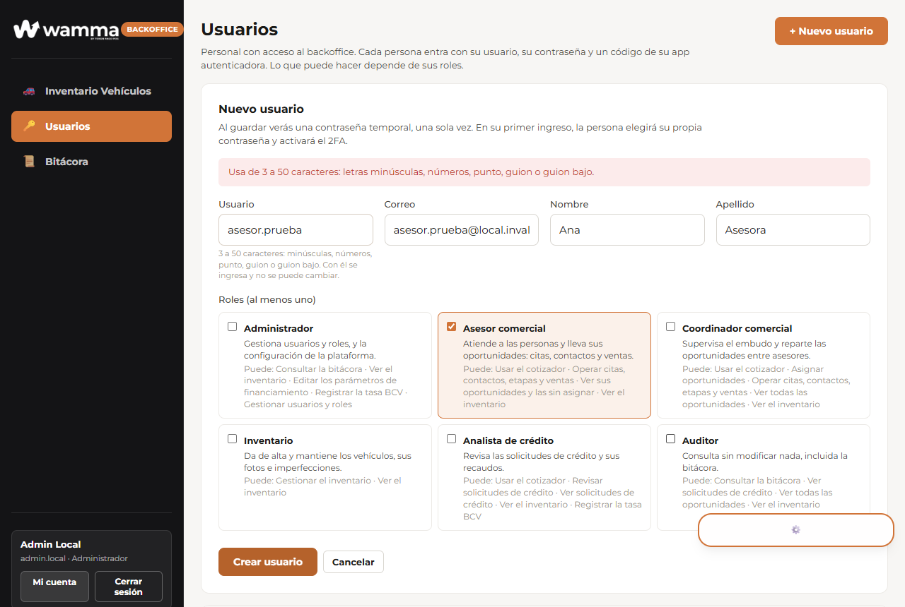
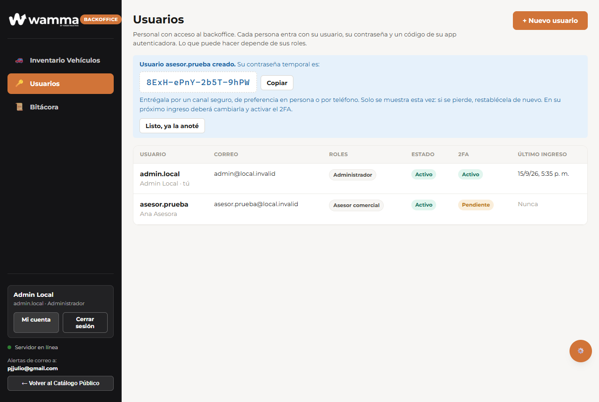

### Editar, desactivar y restablecer

Pulsa una fila de la lista para abrir la ficha del usuario.

| Acción | Qué hace |
|---|---|
| **Guardar cambios** | Guarda nombre, apellido, correo y roles. Los cambios de rol valen desde su siguiente paso por el servidor |
| **Desactivar usuario** | Cierra sus sesiones y le impide ingresar hasta que lo reactives. Nada se borra |
| **Reactivar usuario** | Vuelve a permitir su ingreso con su contraseña y su app |
| **Restablecer contraseña** | Genera una contraseña temporal nueva, que se muestra una vez, y cierra sus sesiones. Deberá cambiarla al ingresar. Su 2FA sigue activo |
| **Restablecer 2FA** | Borra su app registrada y sus códigos de recuperación, y cierra sus sesiones. En su siguiente ingreso registrará la app de nuevo |

Cada acción pide confirmación antes de ejecutarse.

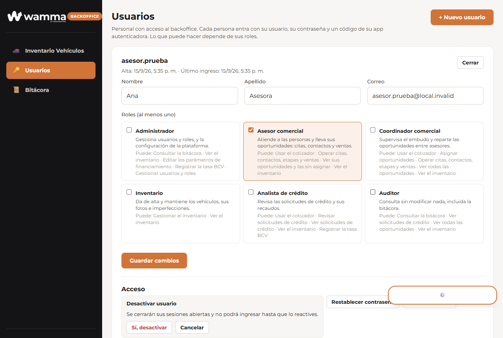

**Reglas:**
- Nadie puede desactivarse a sí mismo. Para cambiar tu propia contraseña, usa **Mi cuenta**.
- Siempre debe quedar **al menos un administrador activo**.
- La lista muestra si una cuenta está **bloqueada** por intentos fallidos y hasta qué hora. Se desbloquea sola.
- **Recomendación:** tener al menos dos administradores. Si el único pierde el teléfono y sus códigos, nadie podrá restablecerle el 2FA.

## Bitácora (roles Administrador y Auditor)

Sección **Bitácora** del backoffice: quién hizo qué y cuándo, empezando por lo más reciente.

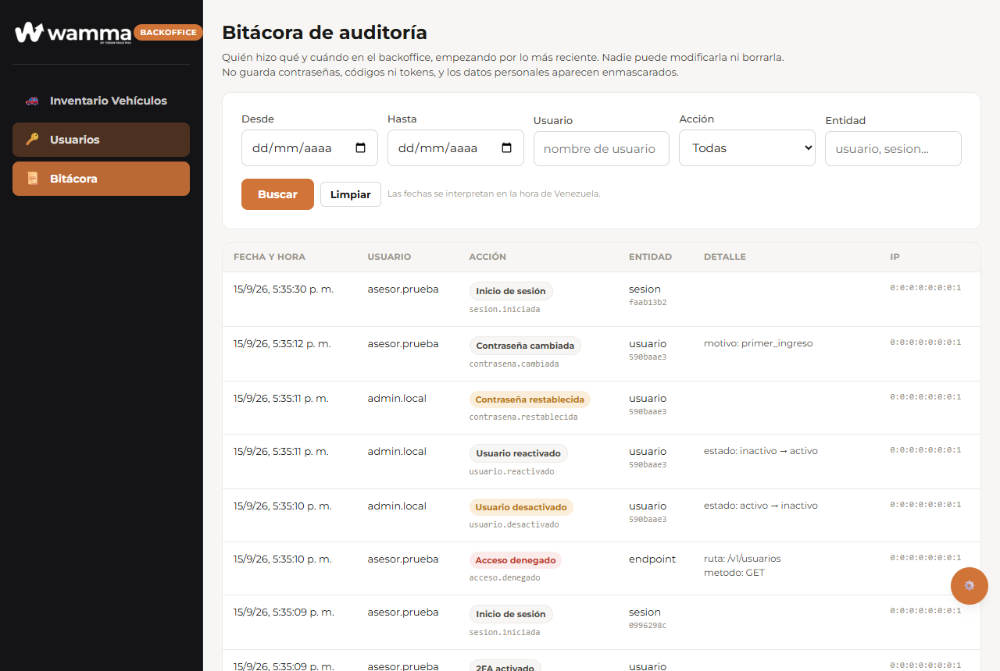

- **Filtros:** fechas desde y hasta (en hora de Venezuela), usuario, acción y entidad. Pulsa **Buscar**; **Limpiar** vuelve a mostrar todo.
- Se ven 50 eventos por página; **Cargar más eventos** trae los siguientes.
- Cada evento muestra fecha y hora, quién actuó, la acción, sobre qué entidad, el detalle (por ejemplo, `estado: activo → inactivo`) y la IP de origen.
- **Nadie puede modificar ni borrar la bitácora**, ni siquiera un administrador: la base de datos lo impide.
- **No guarda** contraseñas, códigos 2FA, códigos de recuperación ni tokens de sesión. Los datos personales aparecen enmascarados.

| En pantalla | Código | Cuándo se registra |
|---|---|---|
| Inicio de sesión | `sesion.iniciada` | Ingreso completo: contraseña y código |
| Ingreso fallido | `sesion.fallida` | Contraseña o código errados, o cuenta bloqueada. El detalle indica el motivo |
| Cierre de sesión | `sesion.cerrada` | Salida con el botón **Cerrar sesión** |
| 2FA activado | `2fa.activado` | Registro de la app autenticadora |
| 2FA restablecido | `2fa.restablecido` | Un administrador lo restableció |
| Código de recuperación usado | `2fa.recuperacion_usada` | Ingreso con un código de recuperación |
| Contraseña cambiada | `contrasena.cambiada` | Primer ingreso o cambio propio |
| Contraseña restablecida | `contrasena.restablecida` | Por un administrador |
| Usuario creado, actualizado, desactivado o reactivado | `usuario.*` | Administración de usuarios |
| Rol asignado o retirado | `rol.asignado` / `rol.retirado` | Cambios de permisos |
| Acceso denegado | `acceso.denegado` | Alguien intentó una acción que su rol no permite |

## Mensajes que puede ver el usuario

| Mensaje | Dónde | Qué significa y qué hacer |
|---|---|---|
| Usuario o contraseña incorrectos. | Ingreso | Alguno de los dos no coincide; por seguridad no se dice cuál. Revisa mayúsculas y teclado. A los 5 fallos seguidos, la cuenta se bloquea |
| Demasiados intentos fallidos. Intenta de nuevo más tarde. | Ingreso | Cuenta bloqueada 15 minutos por 5 fallos seguidos, de contraseña o de código. Se desbloquea sola |
| Hubo demasiados intentos de ingreso desde tu conexión. Espera unos minutos. | Ingreso | Muchos intentos desde la misma red en poco tiempo. Espera unos minutos |
| El código no es válido o ya venció. | Verificación | Código mal escrito, vencido o ya usado. Escribe el que muestra la app ahora o espera al siguiente |
| La contraseña debe tener al menos 12 caracteres. | Crear o cambiar contraseña | Usa una frase más larga |
| La contraseña no puede superar los 128 caracteres. | Crear o cambiar contraseña | Acórtala |
| Esa contraseña es demasiado común. Elige otra. | Crear o cambiar contraseña | Está entre las contraseñas más usadas |
| La contraseña no puede contener tu nombre de usuario. | Crear o cambiar contraseña | Elige otra |
| La contraseña actual no coincide. | Mi cuenta | Revisa la contraseña actual |
| Pasaron más de 5 minutos desde que escribiste tu contraseña. Empieza de nuevo. | Ingreso | El paso intermedio venció. Vuelve a escribir usuario y contraseña |
| Tu sesión terminó: venció o la cerró un administrador. Ingresa de nuevo. | Ingreso | Pasaron 12 horas, o un administrador te desactivó o restableció tu acceso |
| Cerramos tu sesión tras 30 minutos sin actividad. | Ingreso | Ingresa de nuevo |
| Verificando tu sesión… | Backoffice | Se confirma tu sesión con el servidor. Si estaba dormido, puede tardar cerca de un minuto |
| Sin acceso a esta sección | Backoffice | Tu rol no incluye esa sección. Pide el rol a un administrador |
| Debe quedar al menos un administrador activo. | Usuarios | No se puede desactivar ni quitar el rol al último administrador |
| No puedes desactivar tu propia cuenta. | Usuarios | Pide a otro administrador que lo haga |
| Ya existe un usuario con ese nombre de usuario o correo. | Usuarios | Elige otro usuario o revisa el correo |

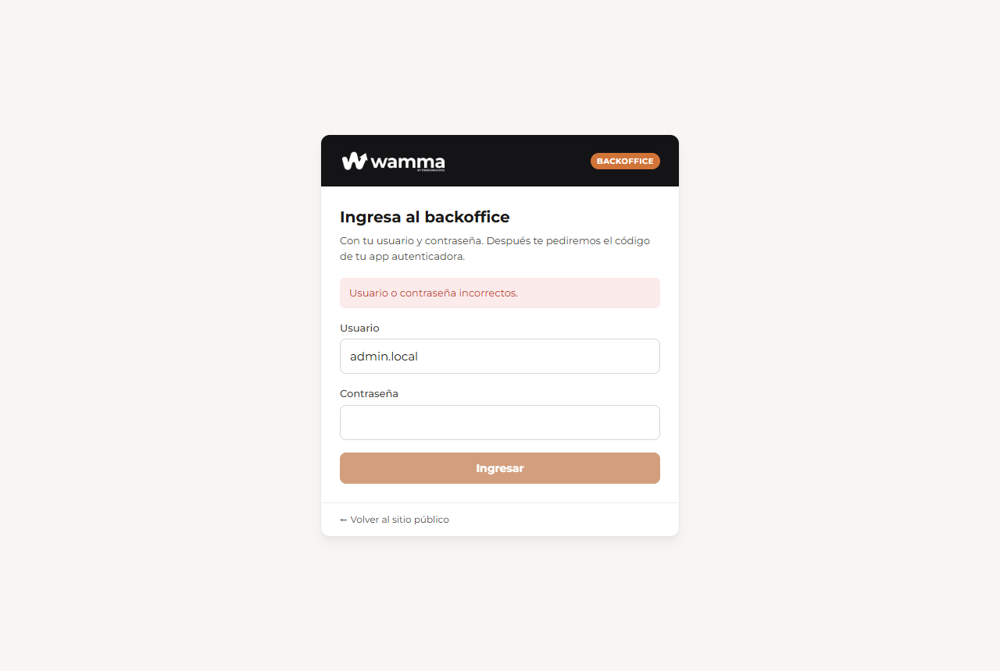
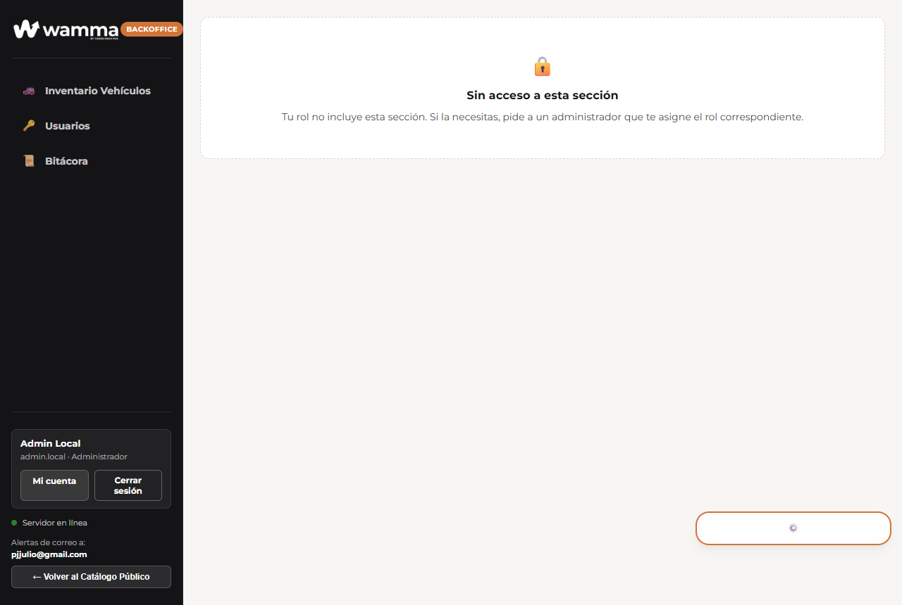

## Primer administrador

El primer administrador es el usuario `hdpinho` (D-07). La plataforma lo crea sola la primera vez que arranca, con los datos que el PO carga en Render, y en su primer ingreso sigue los mismos pasos que cualquier usuario. Después de ese ingreso, el PO borra de Render la contraseña inicial.

## Estado del servidor — *disponible desde la etapa 0*

En la barra lateral del backoffice, sobre "Alertas de correo", un indicador muestra si la plataforma se comunica con el servidor.

| Indicador | Qué significa | Qué hacer |
|---|---|---|
| ⚪ Conectando con el servidor… | Se está comprobando la conexión | Esperar unos segundos |
| 🟠 Despertando el servidor; puede tardar un minuto… | El servidor estaba apagado por inactividad y está arrancando | Esperar. En el plan gratuito, el servidor se apaga tras 15 minutos sin uso y tarda cerca de un minuto en volver (D-19) |
| 🟢 Servidor en línea | Todo normal | — |
| 🔴 Sin conexión con el servidor | No respondió en 90 segundos, o no hay red | Pulsar **Reintentar**. Si persiste, avisar a soporte |
| ⚪ Sin servidor (modo maqueta) | Esta copia del sitio no está conectada a ningún servidor | Solo ocurre en entornos de demostración, y ahí el backoffice se abre sin ingreso |

La pantalla de ingreso también avisa **Despertando el servidor; puede tardar cerca de un minuto…** cuando el primer ingreso del día tarda en responder.

## Errores que puede ver el usuario

Todos los mensajes de error del servidor llegan en español, con un título y una explicación. Un error inesperado muestra además un **código**: al reportarlo, indicar ese código permite a soporte encontrar la causa.
