# 02 · Inventario y catálogo (módulos 004 y 005)

**Quién lo usa:** visitantes del sitio público (vitrina y ficha del vehículo), el rol **Inventario** (alta, fotos y publicación) y el **Administrador** y el **Analista de crédito** (tasa BCV). **Estado:** disponible desde la etapa 2 (15/09/2026): los vehículos, sus fotos y sus imperfecciones viven en el servidor y son los mismos para todo el equipo.

> Las capturas son de un entorno de prueba, con vehículos y datos ficticios.

## Resumen

- El inventario ya **no vive en el navegador**: se guarda en el servidor y lo ve todo el equipo.
- Un vehículo **no aparece en el sitio público hasta que alguien lo publica**. Antes es un **borrador**.
- Los precios se llevan en **euros** (D-21). La vitrina muestra además su equivalencia en bolívares con la **tasa BCV del euro** del día, que se registra desde el backoffice (D-13).
- Para publicar hacen falta **al menos 5 fotos** (máximo 10) y una tasa BCV registrada.
- En esta fase hay **una sola sede**: Distrito Capital (D-23).

## Quién puede hacer qué

| Acción | Inventario | Administrador | Asesor / Coordinador / Analista / Auditor |
|---|:-:|:-:|:-:|
| Ver el inventario del backoffice | ✔ | ✔ | ✔ |
| Dar de alta, editar y retirar vehículos | ✔ | | |
| Subir, ordenar y quitar fotos | ✔ | | |
| Publicar, pausar y publicar los listos | ✔ | | |
| Cambiar la disponibilidad desde el inventario | ✔ | | |
| Registrar la tasa BCV | | ✔ | Analista de crédito ✔ |

Quien solo puede **ver** abre la misma pantalla sin los botones de gestión: no se le ofrece «Nuevo vehículo», ni publicar, ni eliminar, y el selector de disponibilidad aparece desactivado. El servidor aplica la misma regla: aunque se intente por otra vía, la rechaza.

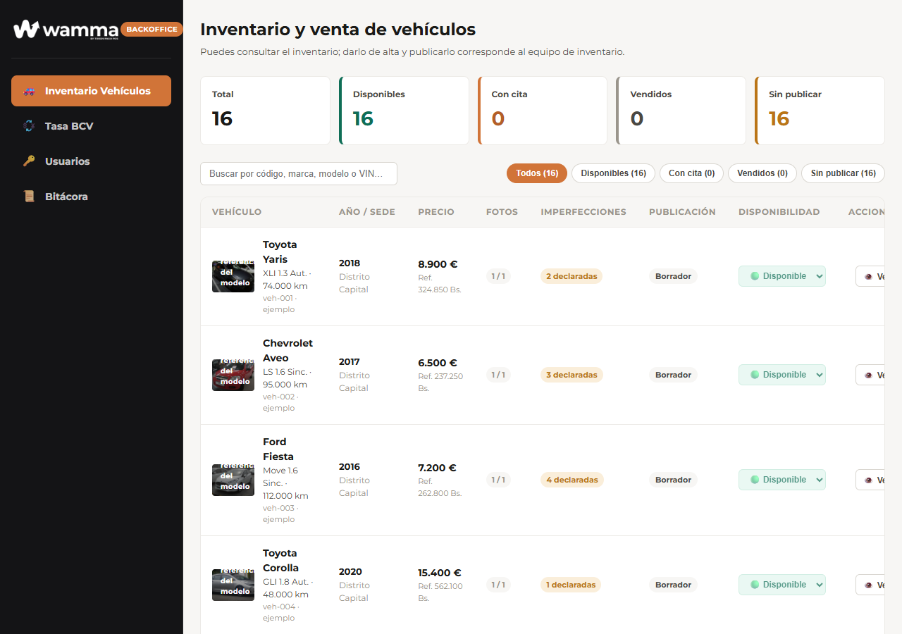

## Tasa BCV del euro

Sección **Tasa BCV** del backoffice. La plataforma trabaja en euros y la vitrina muestra la equivalencia en bolívares, así que **la tasa se registra cada día**. Mientras no haya una nueva, se sigue usando la última registrada.

1. Escribe la **fecha** (por defecto, hoy en Venezuela), los **bolívares por euro** (admite hasta 8 decimales; la coma decimal funciona) y la **fuente** de donde la tomaste.
2. Pulsa **Registrar tasa**. La confirmación dice qué quedó registrado: *Tasa del 15/09/2026 registrada: 45,80 Bs. por euro.*

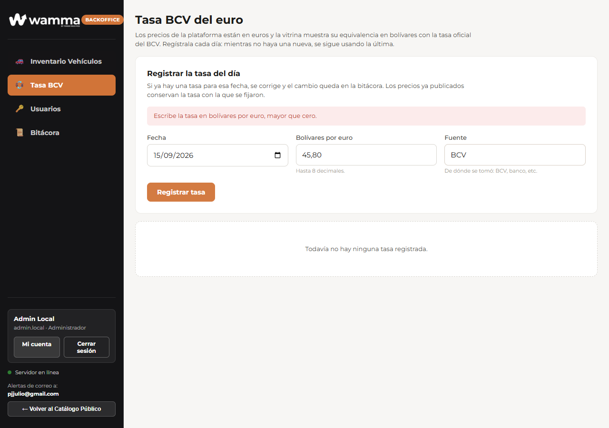
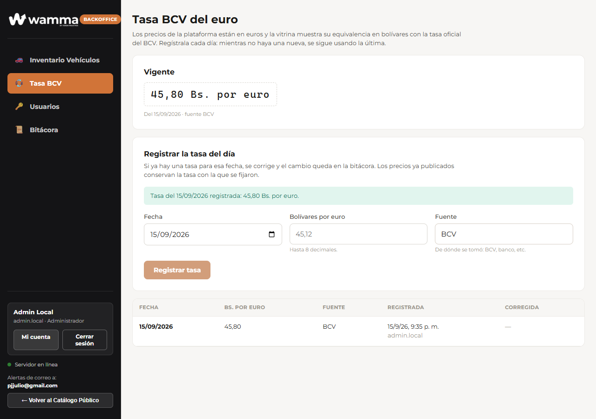

- El panel **Vigente** muestra la que se está usando en este momento, con su fecha y su fuente.
- Si registras una tasa para una fecha que ya tenía, **se corrige**: el cambio queda en la bitácora con el valor anterior y el nuevo, y el historial la marca como corregida.
- **Los vehículos ya publicados conservan la tasa con la que se fijó su precio.** Corregir la tasa de hoy no reescribe lo que ya salió publicado.

## Dar de alta un vehículo (rol Inventario)

Sección **Inventario Vehículos** → **➕ Nuevo vehículo**.

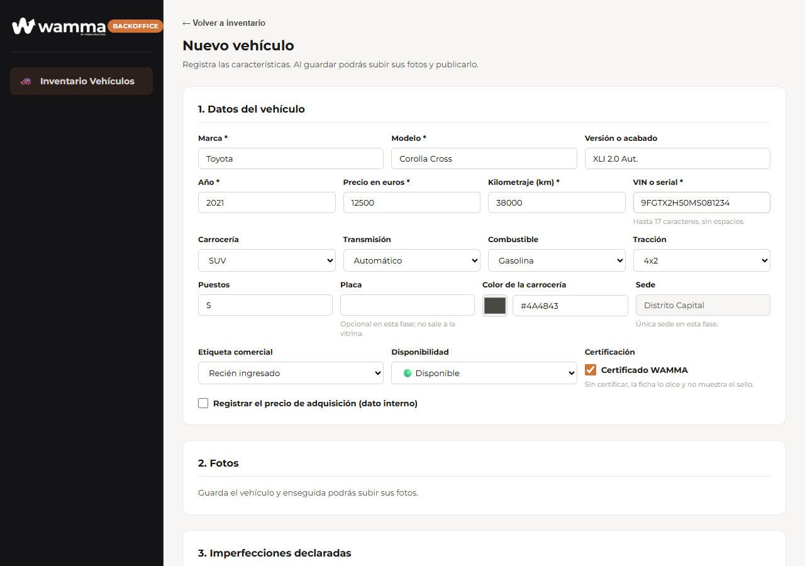

1. **Datos del vehículo.** Marca, modelo, año, precio en euros, kilometraje y VIN son obligatorios. Versión, carrocería, transmisión, combustible, tracción, puestos y color completan la ficha.
   - La **placa** es opcional en esta fase y **no sale al sitio público** (D-12).
   - El **precio de adquisición** también es opcional; si lo registras, va completo: precio, moneda, tasa BCV usada y fecha. Es un dato interno y no se publica.
   - La **sede** es Distrito Capital y no se elige.
2. **Certificación.** Marca **Certificado WAMMA** si el vehículo pasó la inspección. Un vehículo **sin certificar también se puede publicar**: su ficha lo dice y no muestra el sello (decisión E11).
3. **Imperfecciones.** Marca sobre la silueta los rayones, abolladuras o desgaste, con su zona, tipo, severidad y descripción. El comprador las ve en la ficha: declararlas es lo que sostiene la certificación.
4. Pulsa **Crear vehículo**.

La plataforma le asigna un **código de inventario** (`WAM-00017`, y así sucesivamente) y te deja en su ficha para que cargues las fotos. Los 16 vehículos de ejemplo cargados de fábrica usan códigos `veh-001` a `veh-016`.

## Fotos

Se cargan desde la ficha del vehículo, una vez creado.

- Se aceptan **JPEG, PNG y WebP**, hasta 10 MB cada una. Puedes seleccionar varias a la vez.
- Al subirlas, la plataforma las reduce y **les quita los datos de ubicación** (el GPS que graban los teléfonos) antes de guardarlas.
- **La primera es la principal**: es la que se ve en la vitrina. Con las flechas ↑ ↓ cambias el orden, y con ✕ quitas una.
- **Mínimo 5 y máximo 10** (D-10). Mientras falten, la ficha lo dice —*Falta 1 foto (se necesitan al menos 5)*— y el botón de publicar permanece desactivado.

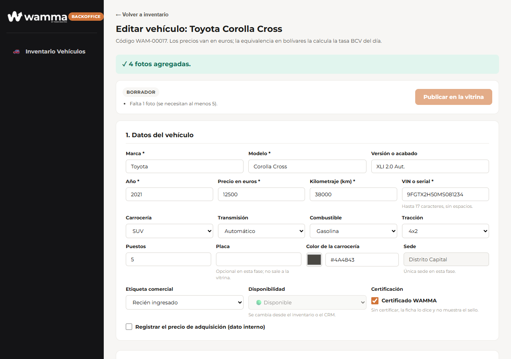
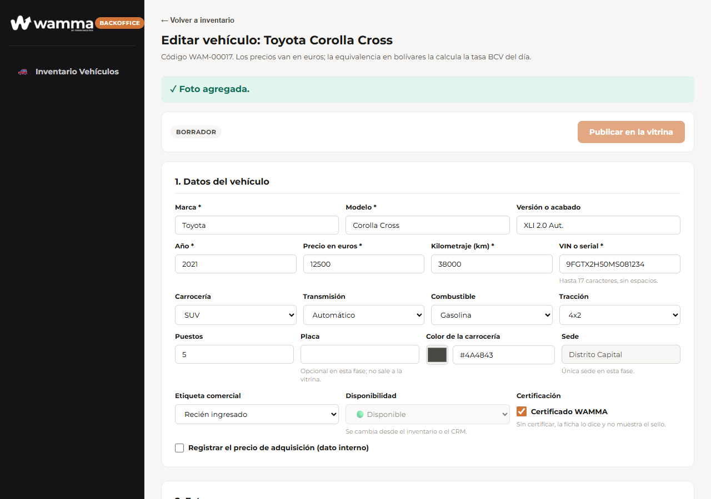

## Publicar

Un vehículo pasa por tres estados:

| Estado | Qué significa |
|---|---|
| **Borrador** | Se está preparando. No aparece en el sitio público |
| **En la vitrina** | Publicado: cualquier visitante lo ve |
| **Pausado** | Estuvo publicado y se retiró. No aparece, pero conserva todo su historial |

- **Publicar en la vitrina** aparece en la ficha del vehículo cuando ya no falta nada. Al publicar, el precio queda fijado con la tasa BCV de ese momento, y la ficha lo deja anotado: *Precio fijado a 45,8 Bs. por euro (2026-09-15).*
- **Pausar publicación** lo retira del sitio público. Se puede volver a publicar cuando se quiera.
- **Publicar los listos** publica de una vez todos los que ya cumplen los requisitos, y avisa cuántos quedaron fuera y por qué. Es la forma de sacar a la vitrina la carga inicial: *16 vehículos publicados.*

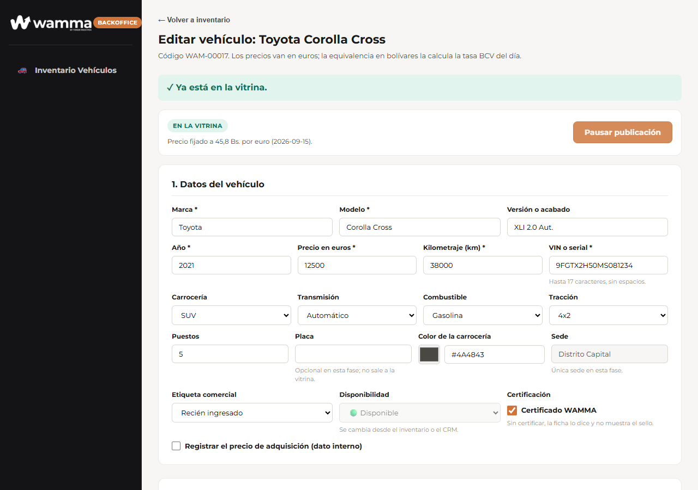
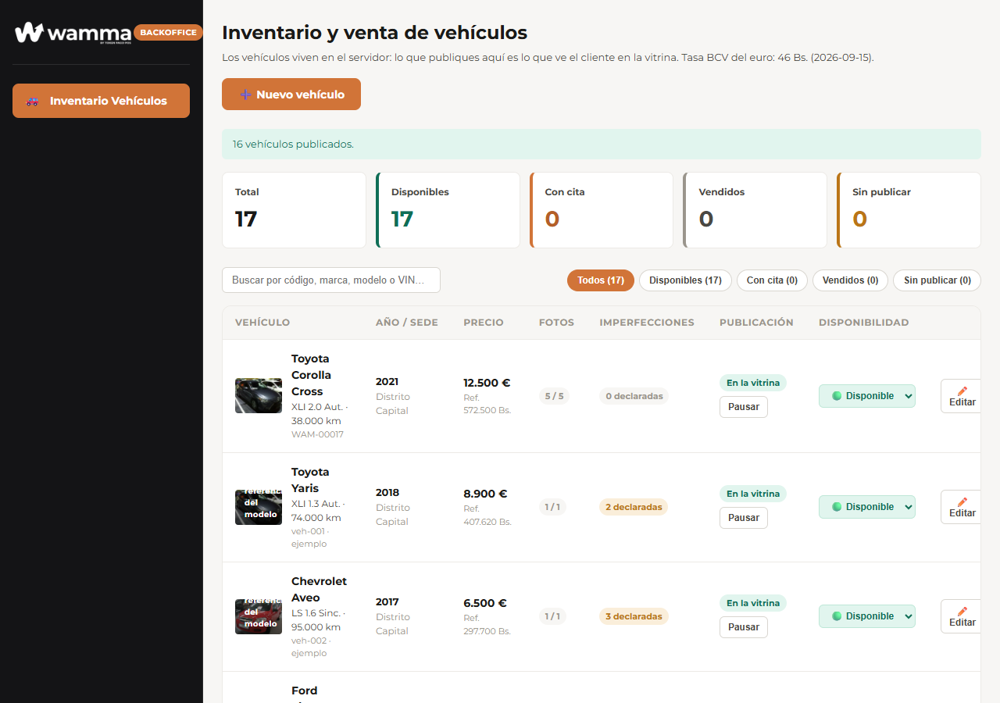

**Eliminar** solo está permitido mientras el vehículo sea un **borrador** que nunca llegó a publicarse. Si ya estuvo en la vitrina, se pausa: así no se pierde el rastro de lo que se ofreció.

## Disponibilidad

Es un eje distinto de la publicación: dice si el vehículo está libre, apalabrado o vendido.

| Estado | Qué ocurre en el sitio público |
|---|---|
| 🟢 Disponible | Se puede agendar cita |
| 🟠 Con cita | Queda reservado: se desactivan *Agendar cita* y *Solicitar financiamiento* para todos |
| ⚪ Vendido | Deja de aparecer en la vitrina |

Desde el inventario la cambia el rol Inventario; en el día a día la mueve el CRM al agendar una cita o cerrar una venta (capítulo 03).

## El sitio público

| Pantalla | Qué ofrece |
|---|---|
| Inicio | Portada directa y minimalista con Hero de búsqueda y video de portada, 3 accesos directos prioritarios («Explora la vitrina», «Inspección 240 puntos» y «Financiamiento directo») y pie de página corporativo `PiePagina` (D-34, D-35). Toda la exploración de vehículos se concentra en la Vitrina |
| Vitrina (catálogo) | Solo los vehículos **publicados** y no vendidos. Filtros específicos por **Cuota mensual**, **Rango de ingresos**, **Marca** (Ford, Chevrolet, Chery, Hyundai, Toyota), **Transmisión** y **Año** (D-28) |
| Ficha del vehículo | Galería estandarizada de fotos de estudio (D-32), especificaciones técnicas, sello de **Inspección 240 puntos**, registro de imperfecciones sobre el diagrama, plan de financiamiento detallado y botón principal **Agendar cita** (D-29, D-30) |
| Favoritos | Los que el visitante marcó con el corazón. Se guardan en su navegador: no requieren cuenta |

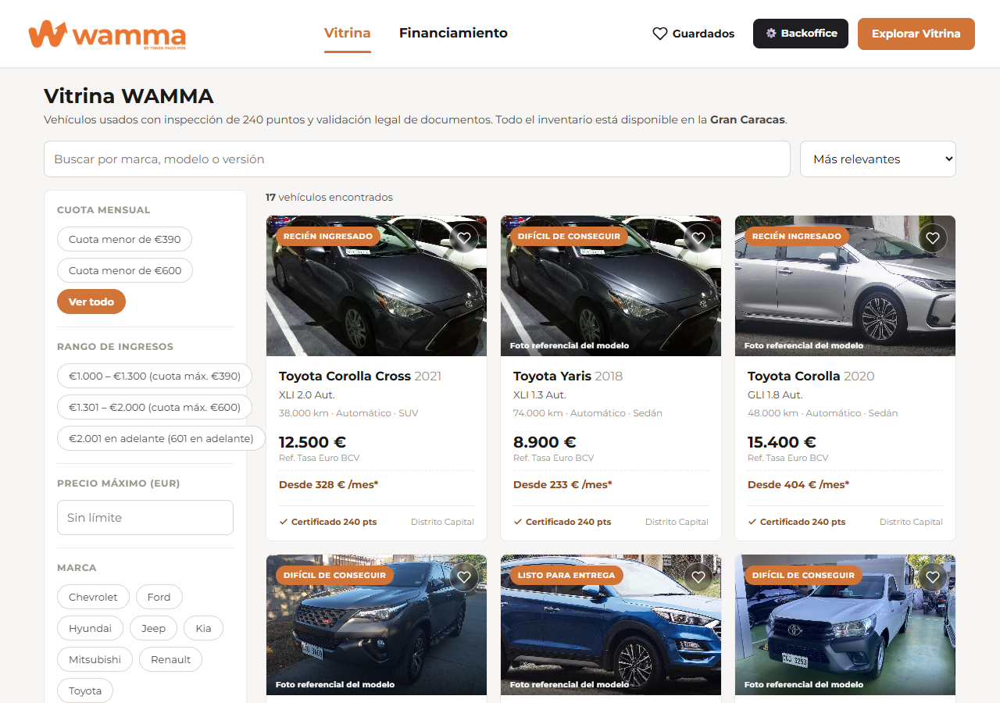
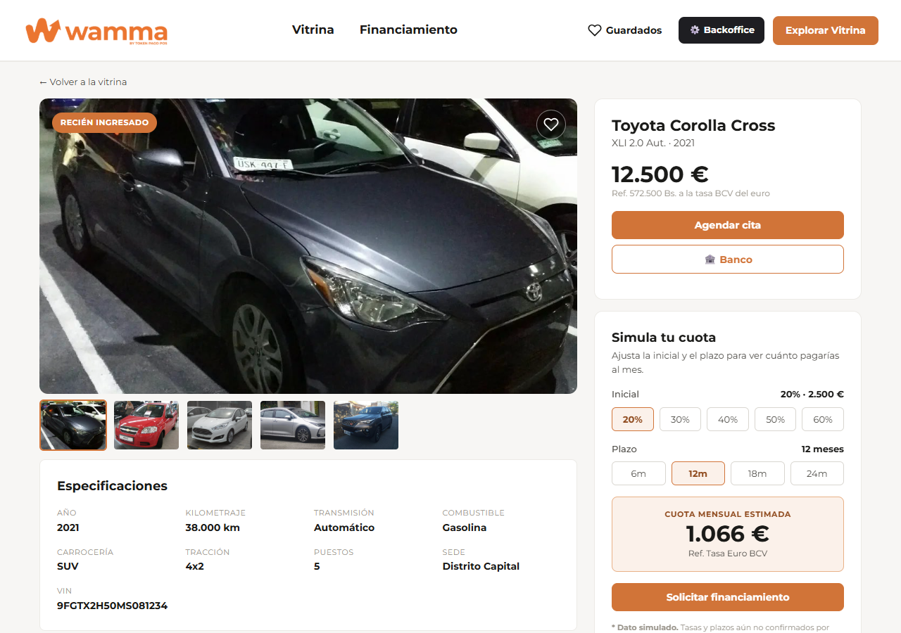

- **Precios y Cuotas (D-27):** En el sitio público **no se muestra el precio total de contado**. La vitrina y fichas se expresan exclusivamente mediante la **Cuota mensual estimada** en euros (`Desde €... /mes*`). Se eliminaron las referencias en bolívares (`Bs.`) y el ajuste dinámico manual de tasa euro del sitio público.
- **Terminología (D-29):** Se utiliza estrictamente **«Inspección 240 puntos»** o **«Estándar WAMMA»** (todo el inventario en vitrina ha superado la inspección, por lo que no existe filtro de "solo certificados"). La sede física tampoco se expone al cliente en la ficha pública.
- **Línea fotográfica (D-32):** Fotografías homogéneas de estudio con fondo de ciclorama neutro e iluminación uniforme a 3/4.
- La vitrina se guarda en caché **un minuto**: un cambio recién hecho puede tardar ese tiempo en verse en el sitio público.

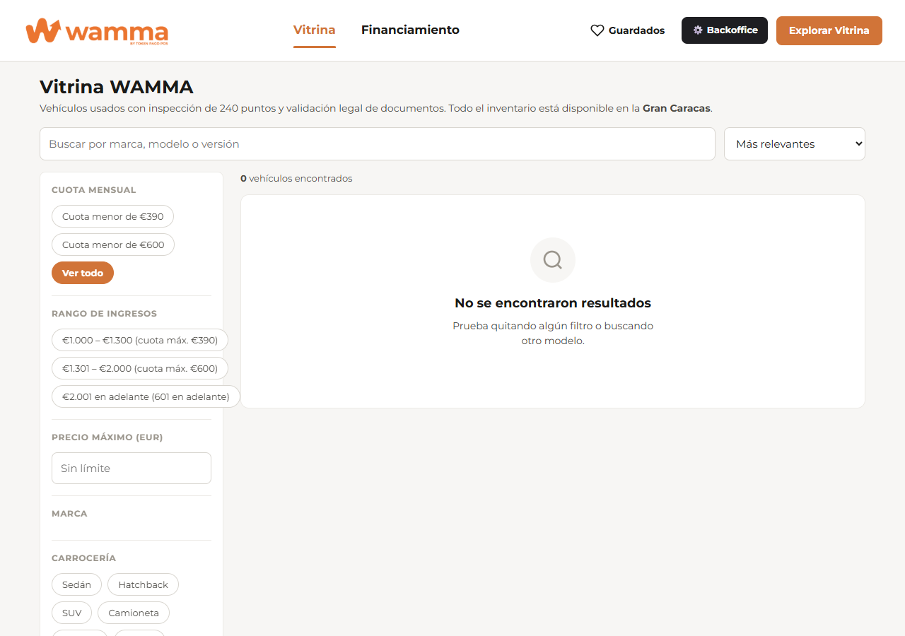
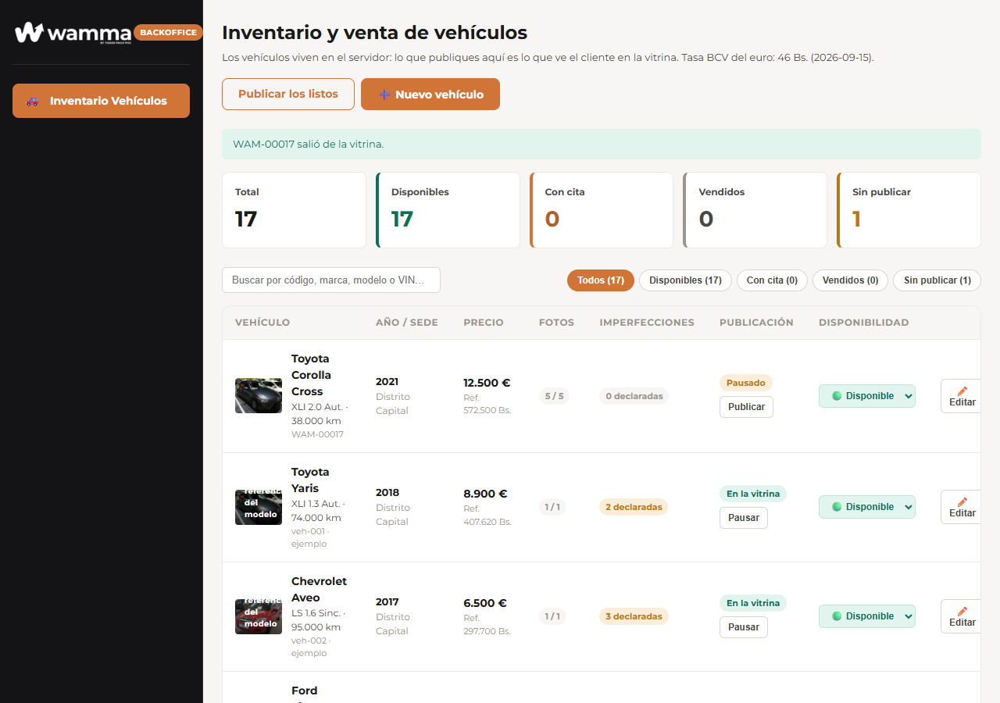

## Mensajes que puede ver el usuario

| Mensaje | Dónde | Qué significa y qué hacer |
|---|---|---|
| Escribe la tasa en bolívares por euro, mayor que cero. | Tasa BCV | El valor está vacío o no es válido |
| Tasa del *(fecha)* registrada: *(valor)* Bs. por euro. | Tasa BCV | Quedó registrada |
| Tasa del *(fecha)* corregida: *(valor)* Bs. por euro. | Tasa BCV | Ya existía una para esa fecha; el cambio quedó en la bitácora |
| Todavía no hay ninguna tasa registrada. | Tasa BCV | Nadie la ha registrado aún. Regístrala antes de publicar |
| Falta *(n)* foto(s) (se necesitan al menos 5). | Ficha del vehículo | Sube las que faltan para poder publicar |
| Ya tiene el máximo de 10 fotos. | Ficha del vehículo | Quita alguna antes de subir otra |
| *(n)* vehículos publicados. Quedan *(n)* sin publicar: … | Inventario | Resultado de **Publicar los listos**, con el motivo de cada uno que quedó fuera |
| Precio fijado a *(valor)* Bs. por euro *(fecha)*. | Ficha del vehículo | Tasa con la que se fijó el precio publicado |
| Este vehículo no existe o fue eliminado. | Ficha del vehículo | El código no corresponde a ningún vehículo |
| Sin acceso a esta sección | Backoffice | Tu rol no incluye esa sección. Pide el rol a un administrador |

## Qué llega más adelante

- Las **citas y el seguimiento comercial** pasan al servidor en la etapa 3 (capítulo 03). Hoy siguen en el navegador.
- El almacenamiento de fotos está preparado para el contenedor definitivo; mientras tanto las sirve el propio servidor.
