# 000 · Diseño Físico y Relacional de Base de Datos — MVP WAMMA

**Clasificación:** Confidencial · **Versión:** 1.1 · **Fecha:** Septiembre 2026  
**Motor:** PostgreSQL 16+ (Supabase Cloud administrado)  
**Gestor de Esquema:** Flyway (Spring Boot) — única fuente de verdad del esquema (§5)  
**Principios vinculantes:** `.specify/memory/constitution.md` (Principios I, II, V, VI, VII)

> **v1.1 (septiembre 2026):** incorpora las migraciones correctivas V0009–V0012: acceso mínimo, inmutabilidad también frente a `TRUNCATE`, cuadre del ledger verificado por el motor, CRM alineado con el spec aprobado 010, trazabilidad monetaria completa y retiro de cifras no confirmadas. Operación en §5; pendientes en §6.

---

## 1. Principios de Ingeniería y Mejores Prácticas DBA

### 1.1 Tipos de Datos y Estándares Monetarios (Principio V)
* **Prohibición estricta de coma flotante (`float`/`double`):** Todos los montos monetarios se declaran como `NUMERIC(18, 2)` o `NUMERIC(18, 4)`. Las tasas de cambio BCV se declaran como `NUMERIC(18, 8)`, para conservarlas sin redondeo (V0011). Las tasas de interés porcentuales usan `NUMERIC(6, 4)`.
* **Regla de Multi-Moneda y Trazabilidad Cambiaria:** Toda tabla que registre dinero debe persistir explícitamente:
  - `monto` (`NUMERIC`)
  - `moneda` (`VARCHAR(3)` — `USD` o `VES`, con `CHECK`)
  - `tasa_bcv` (`NUMERIC(18, 8)`)
  - `fecha_tasa` (`DATE`: la tasa BCV es un valor diario, como `tasa_cambio_bcv.fecha`)
* **Identificadores primarios:** Claves primarias universales en `UUID DEFAULT gen_random_uuid()`. Garantiza unicidad sin colisión, previene enumeración maliciosa y facilita sharding o migraciones entre nubes.
* **Marcas temporales:** Todo timestamp utiliza `TIMESTAMPTZ` con valor por defecto `now()`.
* **Nomenclatura:** Tablas y columnas en minúsculas `snake_case`, nombres de tablas en singular (`usuario`, `persona`, `asiento`, `vehiculo`).

### 1.2 Privacidad, Protección del Dato Personal y Cifrado (Principio I)
* **Cifrado en reposo para PII:** Los campos que identifican directamente a personas físicas (`cedula`, `telefono_whatsapp`, `correo`, `cuenta_bancaria`) se almacenan cifrados a nivel de aplicación (AES-256-GCM) en columnas `BYTEA` (V0010). Los teléfonos viven en `persona_telefono`, uno por fila.
* **Índices ciegos (Blind Indexing):** Para permitir búsquedas exactas deduplicadas (`WHERE cedula = ...` o `WHERE telefono = ...`) sin descifrar masivamente, cada campo sensible cuenta con una columna HMAC-SHA256 con clave separada (`indice_ciego_<campo>`, `VARCHAR(64)`). La cédula es `UNIQUE`; el teléfono **no** (dos personas pueden compartir un teléfono familiar), y por eso la resolución por teléfono queda registrada en `persona.criterio_resolucion`. Un `CHECK` impide guardar el dato cifrado sin su índice ciego, o al revés.

### 1.3 Inmutabilidad y Ledger Sagrado de Partida Doble
* **Tablas Append-Only:** prohibido `UPDATE`, `DELETE` **y `TRUNCATE`** en:
  - `auditoria_evento`
  - `asiento` y `linea_asiento`
  - `interaccion` y `etapa_historial`
  - `fusion_persona`
  - `movimiento_inventario`

  Tres barreras (V0009): trigger de fila contra `UPDATE`/`DELETE`, trigger de sentencia contra `TRUNCATE` (que los de fila no ven, ni siquiera en `TRUNCATE ... CASCADE`) y `REVOKE` al rol de aplicación. Las claves foráneas hacia registros que estas tablas referencian son `ON DELETE RESTRICT`: un `SET NULL` o un `CASCADE` intentaría modificarlas.
* **Cuadre Contable de Partida Doble:** En cada `asiento`, la suma de los débitos (`debe`) debe ser exactamente igual a la suma de los créditos (`haber`):  
  $$\sum \text{debe} = \sum \text{haber}$$
  - Cada línea es débito **o** crédito: `CHECK ((debe > 0 AND haber = 0) OR (debe = 0 AND haber > 0))`.
  - El motor verifica el cuadre con un *constraint trigger* diferido (`verificar_cuadre_asiento`): al confirmar la transacción, todo asiento debe tener al menos dos líneas y cuadrar **por moneda**. `[NEEDS CLARIFICATION: moneda funcional del ledger]` — si contabilidad define una, la regla pasa a cuadrar en esa moneda.
  Cualquier error se subsana únicamente mediante un **asiento compensatorio** que referencia a `compensa_asiento_id`.

### 1.4 Reglas de Indexación y Rendimiento DBA
* Todo campo de clave foránea (`FOREIGN KEY`) posee un índice B-Tree individual o compuesto para optimizar JOINs y evitar table-scans en eliminaciones/actualizaciones padre.
* Índices `UNIQUE` sobre campos de unicidad de negocio (`vin`, `numero_solicitud`, `numero_credito`, `idempotency_key`).
* Ningún índice duplica el que ya crea una restricción `UNIQUE` (V0012 retiró doce duplicados y añadió los que faltaban en claves foráneas).

### 1.5 Acceso a la base (Principio I)
* **Un solo cliente: el backend.** No se usa la API de datos de Supabase (PostgREST). Los roles `anon` y `authenticated` no tienen privilegios sobre el esquema, tampoco por defecto para tablas futuras (V0009).
* **RLS activo en todas las tablas, sin políticas:** deniega por defecto a cualquier rol que no sea el dueño del esquema o `wamma_app`. No autoriza nada (eso lo hace Spring Boot): es la barrera de fondo si alguien expusiera el esquema. Se declara en la migración y no depende del disparador `ensure_rls` de Supabase, así que se conserva al migrar a otro PostgreSQL.
* **Rol de aplicación `wamma_app`:** sin login hasta que se active fuera del repositorio (§5.3). `SELECT/INSERT/UPDATE/DELETE` en tablas mutables; solo `SELECT/INSERT` en las append-only; ningún privilegio sobre `flyway_schema_history`. Tiene `BYPASSRLS` porque la autorización fina vive en la aplicación. Flyway migra con el dueño del esquema.
* `service_role` (llave administrativa de Supabase) no se modifica: no se publica y el backend no la usa.

---

## 2. Diagrama Entidad-Relación Global (Mermaid ER)

```mermaid
erDiagram
    %% ==========================================
    %% MÓDULO 001: SEGURIDAD, ROLES Y AUDITORÍA
    %% ==========================================
    usuario ||--o{ usuario_rol : "tiene"
    rol ||--o{ usuario_rol : "asignado a"
    rol ||--o{ rol_permiso : "posee"
    permiso ||--o{ rol_permiso : "asociado a"
    usuario ||--o{ auditoria_evento : "ejecuta"

    %% ==========================================
    %% MÓDULO 004 y 005: INVENTARIO, PERITAJE Y CATÁLOGO
    %% ==========================================
    sede ||--o{ vehiculo : "alberga"
    vehiculo ||--o{ inspeccion : "evaluado en"
    inspeccion ||--o{ inspeccion_punto : "contiene 240"
    usuario ||--o{ inspeccion : "perita"
    vehiculo ||--o{ validacion_legal : "auditado por"
    vehiculo ||--o{ publicacion : "promocionado en"
    publicacion ||--o{ publicacion_foto : "contiene"
    publicacion ||--o{ reserva : "apartado con"
    vehiculo ||--o{ garantia_devolucion : "protegido con"
    vehiculo ||--o{ movimiento_inventario : "registra traslado"

    %% ==========================================
    %% MÓDULO 010: CRM COMERCIAL Y PROSPECTOS
    %% ==========================================
    usuario ||--o{ persona : "atiende como asesor"
    persona ||--o{ persona_telefono : "tiene"
    persona ||--o{ oportunidad : "manifiesta interes"
    vehiculo ||--o{ oportunidad : "interesa en"
    catalogo_etapa ||--o{ oportunidad : "etapa actual (codigo)"
    catalogo_motivo_perdida ||--o{ oportunidad : "motivo cierre (codigo)"
    oportunidad ||--o{ interaccion : "registra contacto"
    persona ||--o{ interaccion : "involucrado en"
    oportunidad ||--o{ etapa_historial : "traza embudo"
    catalogo_etapa ||--o{ etapa_historial : "etapa anterior y nueva"
    oportunidad ||--o{ cita_inspeccion : "agenda"
    persona ||--o{ cita_inspeccion : "asiste"
    vehiculo ||--o{ cita_inspeccion : "reserva"
    sede ||--o{ cita_inspeccion : "lugar cita"
    persona ||--o{ fusion_persona : "sobrevive"
    persona ||--o{ fusion_persona : "absorbida"

    %% ==========================================
    %% MÓDULO 006 & FIN-001: SOLICITUD DE CRÉDITO Y RIESGO
    %% ==========================================
    oportunidad ||--o| solicitud_credito : "deriva en (lead_id)"
    persona ||--o{ solicitud_credito : "solicitante"
    vehiculo ||--o{ solicitud_credito : "garantia vehiculo"
    solicitud_credito ||--o{ solicitud_recaudo : "adjunta"
    solicitud_credito ||--o| decision_riesgo : "dictamen"
    solicitud_credito ||--o{ alerta_aml : "analisis listas"

    %% ==========================================
    %% MÓDULO 007: FINTECH, PAGOS Y LEDGER
    %% ==========================================
    cuenta_contable ||--o{ cuenta_contable : "subcuenta de"
    asiento ||--o{ linea_asiento : "desglosa partida doble"
    cuenta_contable ||--o{ linea_asiento : "imputa a"
    asiento ||--o| asiento : "compensa a"

    solicitud_credito ||--o| credito : "origina"
    credito ||--o{ cuota : "amortiza en"
    credito ||--o{ pago : "abona a"
    cuota ||--o{ pago : "cancela"
    pago ||--o| asiento : "contabilizado en"
    pago ||--o| conciliacion : "cruzado en"

    %% ==========================================
    %% MÓDULO 009: TESORERÍA Y CONTROL
    %% ==========================================
    usuario ||--o{ tasa_cambio_bcv : "registra tasa"
    persona ||--o{ notificacion : "recibe mensaje"

    %% ==========================================
    %% DEFINICIÓN DE ENTIDADES Y CAMPOS
    %% ==========================================

    usuario {
        uuid id PK
        varchar email UK
        varchar password_hash
        varchar nombre
        varchar apellido
        varchar tipo
        varchar estado
        boolean requiere_2fa
        varchar secreto_2fa_totp
        timestamptz ultimo_login
        timestamptz creado_en
    }

    rol {
        uuid id PK
        varchar codigo UK
        varchar nombre
        varchar ambito
    }

    permiso {
        uuid id PK
        varchar codigo UK
        varchar modulo
        varchar nombre
    }

    auditoria_evento {
        uuid id PK
        uuid actor_id FK
        varchar accion
        varchar entidad
        uuid entidad_id
        jsonb antes
        jsonb despues
        varchar ip_origen
        timestamptz creado_en
    }

    sede {
        uuid id PK
        varchar codigo UK
        varchar nombre
        varchar ciudad
        boolean activo
    }

    vehiculo {
        uuid id PK
        varchar vin UK
        varchar placa UK
        varchar marca
        varchar modelo
        varchar version
        int anio
        int kilometraje
        varchar transmision
        varchar estado
        uuid sede_id FK
        numeric precio_adquisicion
        varchar moneda_adquisicion
        numeric tasa_bcv_adquisicion
        date fecha_tasa_adquisicion
    }

    inspeccion {
        uuid id PK
        uuid vehiculo_id FK
        uuid inspector_id FK
        varchar estado
        int puntaje_total
        varchar resultado
        timestamptz creado_en
    }

    inspeccion_punto {
        uuid id PK
        uuid inspeccion_id FK
        varchar codigo_punto
        varchar categoria
        varchar resultado
        varchar severidad
        varchar zona
        varchar evidencia_url
    }

    validacion_legal {
        uuid id PK
        uuid vehiculo_id FK
        varchar ocr_serial_carroceria
        varchar cruce_intt_status
        varchar cruce_robo_cicpc
        varchar resultado
    }

    publicacion {
        uuid id PK
        uuid vehiculo_id FK
        varchar titulo
        numeric precio_venta
        varchar moneda
        numeric tasa_bcv
        date fecha_tasa
        varchar estado
        timestamptz publicado_en
    }

    persona {
        uuid id PK
        varchar nombre_apellido
        bytea cedula_cifrada
        varchar indice_ciego_cedula UK
        bytea correo_cifrado
        varchar indice_ciego_correo
        varchar canal_origen
        varchar criterio_resolucion
        uuid asesor_id FK
        varchar estado
    }

    persona_telefono {
        uuid id PK
        uuid persona_id FK
        bytea telefono_cifrado
        varchar indice_ciego_telefono
        boolean es_principal
    }

    catalogo_etapa {
        uuid id PK
        varchar codigo UK
        varchar nombre
        smallint orden
        boolean es_terminal
        smallint umbral_estancada_dias
    }

    oportunidad {
        uuid id PK
        uuid persona_id FK
        uuid vehiculo_id FK
        varchar etapa FK
        varchar modalidad_pago
        numeric valor_estimado
        varchar moneda
        numeric tasa_bcv
        date fecha_tasa
        uuid asesor_id FK
        varchar proxima_accion
        date proxima_accion_fecha
        varchar motivo_perdida FK
        uuid solicitud_credito_id
        char enlace_token_hash UK
        timestamptz enlace_expira_en
        timestamptz enlace_usado_en
        int version
    }

    interaccion {
        uuid id PK
        uuid persona_id FK
        uuid oportunidad_id FK
        varchar canal
        varchar direccion
        text nota
        uuid autor_id FK
        uuid corrige_interaccion_id FK
        varchar idempotency_key UK
        timestamptz ocurrido_en
    }

    etapa_historial {
        uuid id PK
        uuid oportunidad_id FK
        varchar etapa_anterior FK
        varchar etapa_nueva FK
        text nota
        uuid actor_id FK
        timestamptz creado_en
    }

    cita_inspeccion {
        uuid id PK
        uuid oportunidad_id FK
        uuid persona_id FK
        uuid vehiculo_id FK
        uuid sede_id FK
        date dia_preferido
        varchar franja
        varchar estado
    }

    solicitud_credito {
        uuid id PK
        varchar numero_solicitud UK
        uuid oportunidad_id FK
        uuid persona_id FK
        uuid vehiculo_id FK
        numeric monto_solicitado
        numeric cuota_inicial
        int plazo_meses
        varchar moneda
        numeric tasa_bcv
        date fecha_tasa
        numeric capacidad_pago_mensual
        varchar estado
    }

    decision_riesgo {
        uuid id PK
        uuid solicitud_id FK
        int score_interno
        int score_buro
        varchar resultado
        numeric limite_aprobado
        numeric cuota_maxima_permitida
        varchar moneda
        numeric tasa_bcv
        date fecha_tasa
    }

    cuenta_contable {
        uuid id PK
        varchar codigo UK
        varchar nombre
        varchar tipo
        varchar naturaleza
        varchar moneda
        boolean activo
    }

    asiento {
        uuid id PK
        varchar numero_asiento UK
        varchar transaccion_ref
        varchar modulo_origen
        text descripcion
        date fecha_asiento
        uuid compensa_asiento_id FK
        uuid creado_por FK
        timestamptz creado_en
    }

    linea_asiento {
        uuid id PK
        uuid asiento_id FK
        uuid cuenta_id FK
        numeric debe
        numeric haber
        varchar moneda
        numeric tasa_bcv
        date fecha_tasa
    }

    credito {
        uuid id PK
        varchar numero_credito UK
        uuid solicitud_id FK
        uuid persona_id FK
        uuid vehiculo_id FK
        numeric principal
        varchar moneda
        numeric tasa_bcv
        date fecha_tasa
        numeric tasa_interes_mensual
        int plazo_meses
        varchar estado
    }

    cuota {
        uuid id PK
        uuid credito_id FK
        int numero_cuota
        date fecha_vencimiento
        numeric capital
        numeric interes
        numeric mora
        numeric cuota_total
        numeric saldo_remanente
        varchar moneda
        numeric tasa_bcv
        date fecha_tasa
        varchar estado
    }

    pago {
        uuid id PK
        uuid credito_id FK
        uuid cuota_id FK
        numeric monto_pagado
        varchar moneda
        numeric tasa_bcv
        date fecha_tasa
        varchar canal_pago
        varchar referencia_bancaria
        varchar idempotency_key UK
        varchar estado
        uuid asiento_id FK
    }

    conciliacion {
        uuid id PK
        uuid pago_id FK
        varchar extracto_bancario_ref
        numeric monto_extracto
        varchar moneda
        numeric tasa_bcv
        date fecha_tasa
        date fecha_banco
        varchar estado
    }
```



---

## 3. Diccionario Físico de Tablas por Dominio

### Dominio 1: Identidad, Seguridad y Auditoría (001)

#### 1. `usuario`
Identidad de operadores, asesores, peritos y administradores.
* `id` (UUID, PK, `gen_random_uuid()`)
* `email` (VARCHAR(150), UNIQUE, NOT NULL)
* `password_hash` (VARCHAR(255), NOT NULL) — Argon2id / BCrypt
* `nombre` (VARCHAR(100), NOT NULL)
* `apellido` (VARCHAR(100), NOT NULL)
* `tipo` (VARCHAR(30), NOT NULL) — `admin`, `oficial_cumplimiento`, `auditor`, `riesgo`, `inspector`, `asesor`
* `estado` (VARCHAR(20), NOT NULL, DEFAULT `'activo'`) — `activo`, `inactivo`, `bloqueado`
* `requiere_2fa` (BOOLEAN, NOT NULL, DEFAULT true)
* `secreto_2fa_totp` (VARCHAR(128)) — Cifrado
* `ultimo_login` (TIMESTAMPTZ)
* `creado_en` (TIMESTAMPTZ, NOT NULL, DEFAULT `now()`)
* `actualizado_en` (TIMESTAMPTZ, NOT NULL, DEFAULT `now()`)

#### 2. `rol`
* `id` (UUID, PK)
* `codigo` (VARCHAR(50), UNIQUE, NOT NULL) — e.g. `ROLE_OFICIAL_CUMPLIMIENTO`
* `nombre` (VARCHAR(100), NOT NULL)
* `descripcion` (TEXT)
* `ambito` (VARCHAR(50), NOT NULL) — Refleja la separación institucional de funciones
* `creado_en` (TIMESTAMPTZ, DEFAULT `now()`)

#### 3. `permiso`
* `id` (UUID, PK)
* `codigo` (VARCHAR(100), UNIQUE, NOT NULL) — e.g. `INSPECCION_APROBAR`, `LEDGER_AUDITAR`
* `modulo` (VARCHAR(50), NOT NULL)
* `nombre` (VARCHAR(100), NOT NULL)
* `descripcion` (TEXT)

#### 4. `usuario_rol` (Junction)
* `usuario_id` (UUID, FK -> `usuario.id`, PK, ON DELETE CASCADE)
* `rol_id` (UUID, FK -> `rol.id`, PK, ON DELETE RESTRICT)
* `asignado_en` (TIMESTAMPTZ, DEFAULT `now()`)
* `asignado_por` (UUID, FK -> `usuario.id`)

#### 5. `rol_permiso` (Junction)
* `rol_id` (UUID, FK -> `rol.id`, PK, ON DELETE CASCADE)
* `permiso_id` (UUID, FK -> `permiso.id`, PK, ON DELETE RESTRICT)

#### 6. `auditoria_evento` (INMUTABLE / APPEND-ONLY)
Bitácora estricta para toda transacción monetaria, cambio de estado de auto o acceso sensible.
* `id` (UUID, PK)
* `actor_id` (UUID, FK -> `usuario.id`, ON DELETE RESTRICT, NULL si es anónimo/sistema)
* `accion` (VARCHAR(100), NOT NULL) — e.g. `VEHICULO_ESTADO_CAMBIO`, `PAGO_REGISTRADO`
* `entidad` (VARCHAR(60), NOT NULL) — e.g. `vehiculo`, `pago`, `asiento`
* `entidad_id` (UUID, NOT NULL)
* `antes` (JSONB)
* `despues` (JSONB)
* `ip_origen` (VARCHAR(45))
* `user_agent` (TEXT)
* `creado_en` (TIMESTAMPTZ, NOT NULL, DEFAULT `now()`)
* *Restricción:* triggers que prohíben `UPDATE`, `DELETE` y `TRUNCATE`; los usuarios se desactivan, no se borran.

#### 7. `secreto_config`
Referencias a secretos fuera de la base de datos (Constitución Principio VI).
* `id` (UUID, PK)
* `clave` (VARCHAR(100), UNIQUE, NOT NULL)
* `referencia_vault` (VARCHAR(255), NOT NULL)
* `descripcion` (TEXT)
* `creado_en` (TIMESTAMPTZ, DEFAULT `now()`)
* `actualizado_en` (TIMESTAMPTZ, DEFAULT `now()`)

---

### Dominio 2: Inventario, Peritaje y Validación Legal (004)

#### 8. `sede`
Patios físicos de exhibición, inspección y entrega.
* `id` (UUID, PK)
* `codigo` (VARCHAR(20), UNIQUE, NOT NULL) — e.g. `CCS-BELLO-MONTE`
* `nombre` (VARCHAR(100), NOT NULL)
* `direccion` (TEXT, NOT NULL)
* `ciudad` (VARCHAR(60), NOT NULL)
* `estado_geografico` (VARCHAR(60), NOT NULL)
* `activo` (BOOLEAN, DEFAULT true)

#### 9. `vehiculo`
Inventario propio adquirido por WAMMA.
* `id` (UUID, PK)
* `vin` (VARCHAR(17), UNIQUE, NOT NULL)
* `placa` (VARCHAR(10), UNIQUE, NOT NULL)
* `marca` (VARCHAR(50), NOT NULL)
* `modelo` (VARCHAR(50), NOT NULL)
* `version` (VARCHAR(50))
* `anio` (SMALLINT, NOT NULL) — `CHECK (anio >= 1900)`; el rango 1990–2035 de V0003 era una regla inventada
* `color` (VARCHAR(40), NOT NULL)
* `kilometraje` (INT, NOT NULL)
* `carroceria` (VARCHAR(40)) — Sedán, SUV, Hatchback, Pickup
* `transmision` (VARCHAR(30), NOT NULL) — Automático, Manual
* `combustible` (VARCHAR(30), NOT NULL) — Gasolina, Diésel, Híbrido
* `traccion` (VARCHAR(20)) — 4x2, 4x4, AWD. Sin valor por defecto (V0011)
* `puestos` (SMALLINT) — Sin valor por defecto (V0011)
* `estado` (VARCHAR(30), NOT NULL) — `inspeccion`, `reacondicionamiento`, `exhibicion`, `reservado`, `vendido`, `bloqueado_legal`
* `sede_id` (UUID, FK -> `sede.id`, NOT NULL)
* `precio_adquisicion` (NUMERIC(18, 2), NOT NULL)
* `moneda_adquisicion` (VARCHAR(3), NOT NULL, DEFAULT `'USD'`) — `USD` o `VES`
* `tasa_bcv_adquisicion` (NUMERIC(18, 8), NOT NULL)
* `fecha_tasa_adquisicion` (DATE, NOT NULL)
* `creado_en` (TIMESTAMPTZ, DEFAULT `now()`)
* `actualizado_en` (TIMESTAMPTZ, DEFAULT `now()`)

#### 10. `inspeccion`
Cabecera del peritaje técnico de 240 puntos.
* `id` (UUID, PK)
* `vehiculo_id` (UUID, FK -> `vehiculo.id`, NOT NULL)
* `inspector_id` (UUID, FK -> `usuario.id`, NOT NULL)
* `estado` (VARCHAR(25), NOT NULL) — `iniciada`, `en_progreso`, `completada`, `certificada`, `rechazada`
* `iniciado_en` (TIMESTAMPTZ, DEFAULT `now()`)
* `finalizado_en` (TIMESTAMPTZ)
* `puntaje_total` (SMALLINT) — 0 a 240
* `resultado` (VARCHAR(20)) — `apto`, `no_apto`, `con_observaciones`
* `notas_generales` (TEXT)
* `creado_en` (TIMESTAMPTZ, DEFAULT `now()`)

#### 11. `inspeccion_punto`
Cada uno de los exactamente **240 puntos** auditados.
* `id` (UUID, PK)
* `inspeccion_id` (UUID, FK -> `inspeccion.id`, ON DELETE CASCADE, NOT NULL)
* `codigo_punto` (VARCHAR(20), NOT NULL) — e.g. `MEC-FREN-01`, `EST-EXT-14`
* `categoria` (VARCHAR(30), NOT NULL) — `mecanica`, `estetica`, `legal`
* `nombre_punto` (VARCHAR(150), NOT NULL)
* `resultado` (VARCHAR(20), NOT NULL) — `conforme`, `no_conforme`, `no_aplica`
* `severidad` (VARCHAR(20)) — `leve`, `moderada`, `grave`
* `zona` (VARCHAR(30)) — `exterior`, `interior`, `motor`, `chasis`, `tren_delantero`
* `posicion_x` (NUMERIC(5, 2)) — Coordenada para visualización de imperfección en ficha C2
* `posicion_y` (NUMERIC(5, 2))
* `evidencia_url` (TEXT)
* `notas` (TEXT)
* `creado_en` (TIMESTAMPTZ, DEFAULT `now()`)
* *Índice Único:* `UNIQUE (inspeccion_id, codigo_punto)`

#### 12. `validacion_legal`
Cruce contra registros INTT, CICPC (hurto/robo) y solvencias fiscales.
* `id` (UUID, PK)
* `vehiculo_id` (UUID, FK -> `vehiculo.id`, NOT NULL)
* `analista_id` (UUID, FK -> `usuario.id`, NOT NULL)
* `ocr_serial_carroceria` (VARCHAR(30), NOT NULL)
* `ocr_serial_motor` (VARCHAR(30), NOT NULL)
* `cruce_intt_status` (VARCHAR(30), NOT NULL) — `valido`, `no_coincide`, `observado`
* `cruce_robo_cicpc` (VARCHAR(30), NOT NULL) — `sin_novedad`, `solicitado_robo`
* `cruce_multas_deudas` (VARCHAR(30), NOT NULL) — `solvente`, `con_deuda`
* `resultado` (VARCHAR(25), NOT NULL) — `aprobado`, `rechazado_legal`
* `observaciones` (TEXT)
* `verificado_en` (TIMESTAMPTZ, DEFAULT `now()`)

---

### Dominio 3: Catálogo, Publicación y Garantía (005)

#### 13. `publicacion`
Vehículos certificados visibles en la vitrina pública.
* `id` (UUID, PK)
* `vehiculo_id` (UUID, FK -> `vehiculo.id`, UNIQUE, NOT NULL)
* `titulo` (VARCHAR(150), NOT NULL)
* `descripcion` (TEXT)
* `precio_venta` (NUMERIC(18, 2), NOT NULL)
* `moneda` (VARCHAR(3), NOT NULL, DEFAULT `'USD'`) — `USD` o `VES`
* `tasa_bcv` (NUMERIC(18, 8), NOT NULL)
* `fecha_tasa` (DATE, NOT NULL)
* `garantia_meses` (SMALLINT) — Sin valor por defecto: `[NEEDS CLARIFICATION: condiciones de garantía]` (spec 005)
* `kilometraje_garantia` (INT) — Ídem
* `estado` (VARCHAR(25), NOT NULL, DEFAULT `'publicado'`) — `borrador`, `publicado`, `pausado`, `vendido`
* `publicado_en` (TIMESTAMPTZ)
* `creado_por` (UUID, FK -> `usuario.id`)
* `creado_en` (TIMESTAMPTZ, DEFAULT `now()`)

#### 14. `publicacion_foto`
Fotografías de alta resolución del vehículo publicado.
* `id` (UUID, PK)
* `publicacion_id` (UUID, FK -> `publicacion.id`, ON DELETE CASCADE, NOT NULL)
* `url` (TEXT, NOT NULL)
* `orden` (SMALLINT, NOT NULL, DEFAULT 0)
* `es_principal` (BOOLEAN, DEFAULT false)
* `etiqueta` (VARCHAR(50)) — `frente`, `trasera`, `lateral_izq`, `interior`, `tablero`, `motor`
* `creado_en` (TIMESTAMPTZ, DEFAULT `now()`)

#### 15. `reserva`
Apartado temporal de un vehículo en la vitrina con pago inicial.
* `id` (UUID, PK)
* `publicacion_id` (UUID, FK -> `publicacion.id`, NOT NULL)
* `persona_id` (UUID, FK -> `persona.id`, NOT NULL)
* `monto_reserva` (NUMERIC(18, 2), NOT NULL)
* `moneda` (VARCHAR(3), NOT NULL, DEFAULT `'USD'`) — `USD` o `VES`
* `tasa_bcv` (NUMERIC(18, 8), NOT NULL)
* `fecha_tasa` (DATE, NOT NULL)
* `metodo_pago` (VARCHAR(30), NOT NULL) — `pago_movil`, `c2p`, `transferencia`
* `comprobante_ref` (VARCHAR(100))
* `estado` (VARCHAR(25), NOT NULL, sin valor por defecto) — `pendiente_confirmacion`, `confirmada`, `expirada`, `reembolsada`, `convertida_en_venta`
* `expiracion_en` (TIMESTAMPTZ, NOT NULL) — La vigencia la fija el negocio
* `creado_en` (TIMESTAMPTZ, DEFAULT `now()`)

#### 16. `garantia_devolucion`
Condiciones y seguimiento de post-venta WAMMA.
* `id` (UUID, PK)
* `vehiculo_id` (UUID, FK -> `vehiculo.id`, NOT NULL)
* `cliente_persona_id` (UUID, FK -> `persona.id`, NOT NULL)
* `condiciones` (TEXT, NOT NULL)
* `fecha_inicio` (DATE, NOT NULL)
* `fecha_fin` (DATE, NOT NULL)
* `estado` (VARCHAR(25), NOT NULL, DEFAULT `'activa'`) — `activa`, `expirada`, `en_reclamo`, `anulada`
* `creado_en` (TIMESTAMPTZ, DEFAULT `now()`)

---

### Dominio 4: CRM Comercial y Gestión de Personas (010)

> Alineado con `specs/010-crm-comercial/spec.md` (aprobado) por V0010. Las identidades de usuario (`asesor_id`, `autor_id`, `actor_id`, `fusionada_por`) admiten nulo hasta que exista el módulo 001.

#### 17. `persona`
Raíz de contacto del ámbito comercial. Deduplicada por cédula o, si falta, por cualquiera de sus teléfonos.
* `id` (UUID, PK)
* `nombre_apellido` (VARCHAR(150), NOT NULL)
* `cedula_cifrada` (BYTEA) — PII cifrada (AES-256-GCM)
* `indice_ciego_cedula` (VARCHAR(64), UNIQUE) — HMAC para búsqueda exacta; va junto con `cedula_cifrada` o no va (`CHECK`)
* `correo_cifrado` (BYTEA)
* `indice_ciego_correo` (VARCHAR(64)) — Ídem con `correo_cifrado`
* `canal_origen` (VARCHAR(40), NOT NULL) — Texto trazado, sin lista cerrada (plan 010 §3.2)
* `criterio_resolucion` (VARCHAR(10), NOT NULL) — `cedula`, `telefono`, `nueva`: cómo se resolvió la identidad al capturarla
* `asesor_id` (UUID, FK -> `usuario.id`)
* `estado` (VARCHAR(20), NOT NULL, DEFAULT `'activo'`) — `activo`, `fusionado`, `bloqueado`
* `creado_en` (TIMESTAMPTZ, DEFAULT `now()`)
* `actualizado_en` (TIMESTAMPTZ, DEFAULT `now()`)

#### 17.1 `persona_telefono`
Un teléfono por fila: la deduplicación busca por cualquiera de ellos con un índice (plan 010 §5).
* `id` (UUID, PK)
* `persona_id` (UUID, FK -> `persona.id`, NOT NULL)
* `telefono_cifrado` (BYTEA, NOT NULL)
* `indice_ciego_telefono` (VARCHAR(64), NOT NULL) — Indexado, **no** único: dos personas pueden compartir un teléfono familiar
* `es_principal` (BOOLEAN, NOT NULL, DEFAULT false) — Como mucho uno por persona (índice único parcial). El principal es el último que dio el cliente
* `creado_en` (TIMESTAMPTZ, DEFAULT `now()`)
* *Índice Único:* `UNIQUE (persona_id, indice_ciego_telefono)`

#### 18. `fusion_persona` (APPEND-ONLY)
Traza de cada consolidación al llegar la cédula (plan 010 §5.1). La persona absorbida no se borra: queda en estado `fusionado`.
* `id` (UUID, PK)
* `persona_sobreviviente_id` (UUID, FK -> `persona.id`, NOT NULL)
* `persona_absorbida_id` (UUID, FK -> `persona.id`, NOT NULL)
* `copia_absorbida_json` (JSONB, NOT NULL) — Respaldo completo del registro fusionado; los datos personales van **ya cifrados**, nunca en claro
* `oportunidad_ids` (UUID[], NOT NULL)
* `cita_ids` (UUID[], NOT NULL)
* `interaccion_ids` (UUID[], NOT NULL)
* `fusionada_en` (TIMESTAMPTZ, NOT NULL, DEFAULT `now()`)
* `fusionada_por` (UUID, FK -> `usuario.id`)

#### 19. `catalogo_etapa`
Catálogo cerrado de fases del embudo (spec 010 §8.1) con su umbral de estancamiento (§8.6).
* `id` (UUID, PK)
* `codigo` (VARCHAR(40), UNIQUE, NOT NULL) — `nuevo`, `contactado`, `cita_confirmada`, `visito`, `negociacion`, `cerrado_ganado`, `cerrado_perdido`
* `nombre` (VARCHAR(80), NOT NULL)
* `orden` (SMALLINT, NOT NULL)
* `es_terminal` (BOOLEAN, NOT NULL, DEFAULT false)
* `umbral_estancada_dias` (SMALLINT) — 2, 3, 7, 7 y 14 días en las etapas abiertas; nulo en las terminales (`CHECK`)
* `activo` (BOOLEAN, DEFAULT true)

#### 20. `catalogo_motivo_perdida`
Catálogo cerrado de motivos de pérdida (spec 010 §8.2).
* `id` (UUID, PK)
* `codigo` (VARCHAR(40), UNIQUE, NOT NULL) — `precio_fuera_de_presupuesto`, `no_califico_financiamiento`, `compro_en_otra_parte`, `dejo_de_responder`, `vehiculo_vendido_a_otro_cliente`, `no_era_el_vehiculo_buscado`, `otro`
* `nombre` (VARCHAR(100), NOT NULL)
* `exige_texto` (BOOLEAN, DEFAULT false) — Solo `otro`
* `activo` (BOOLEAN, DEFAULT true)

#### 21. `oportunidad`
Intención de compra de una persona sobre un vehículo particular.
* `id` (UUID, PK)
* `persona_id` (UUID, FK -> `persona.id`, NOT NULL)
* `vehiculo_id` (UUID, FK -> `vehiculo.id`, NOT NULL)
* `etapa` (VARCHAR(40), FK -> `catalogo_etapa.codigo`, NOT NULL, DEFAULT `'nuevo'`)
* `modalidad_pago` (VARCHAR(25), NOT NULL) — `contado`, `financiamiento`
* `valor_estimado` (NUMERIC(18, 2), NOT NULL)
* `moneda` (VARCHAR(3), NOT NULL, DEFAULT `'USD'`) — `USD` o `VES`
* `tasa_bcv` (NUMERIC(18, 8), NOT NULL)
* `fecha_tasa` (DATE, NOT NULL)
* `asesor_id` (UUID, FK -> `usuario.id`) — Nulo = sin asignar
* `proxima_accion` (VARCHAR(150))
* `proxima_accion_fecha` (DATE)
* `motivo_perdida` (VARCHAR(40), FK -> `catalogo_motivo_perdida.codigo`) — Obligatorio si y solo si `etapa = 'cerrado_perdido'` (`CHECK`, CA-010.2)
* `detalle_perdida` (TEXT)
* `solicitud_credito_id` (UUID) — Puntero de solo lectura, no unión de datos
* `enlace_token_hash` (CHAR(64), UNIQUE) — SHA-256 del token del enlace personal de financiamiento; el token nunca se guarda
* `enlace_emitido_en` (TIMESTAMPTZ)
* `enlace_expira_en` (TIMESTAMPTZ) — Obligatorio y posterior a la emisión si hay enlace (`CHECK`). El plazo lo fija el negocio
* `enlace_usado_en` (TIMESTAMPTZ) — Un solo uso
* `version` (INTEGER, NOT NULL, DEFAULT 0) — Control optimista del `PATCH` de etapa (`If-Match`)
* `cerrado_en` (TIMESTAMPTZ)
* `creado_en` (TIMESTAMPTZ, DEFAULT `now()`)
* `actualizado_en` (TIMESTAMPTZ, DEFAULT `now()`)

#### 22. `interaccion` (APPEND-ONLY)
Bitácora de contactos con el cliente. No se edita; las correcciones referencian al registro previo.
* `id` (UUID, PK)
* `persona_id` (UUID, FK -> `persona.id`, NOT NULL)
* `oportunidad_id` (UUID, FK -> `oportunidad.id`, ON DELETE RESTRICT)
* `canal` (VARCHAR(30), NOT NULL) — `whatsapp`, `llamada`, `correo`, `presencial` (validados en la maqueta)
* `direccion` (VARCHAR(20), NOT NULL) — `entrante`, `saliente`
* `nota` (TEXT, NOT NULL)
* `autor_id` (UUID, FK -> `usuario.id`)
* `corrige_interaccion_id` (UUID, FK -> `interaccion.id`)
* `idempotency_key` (VARCHAR(128), UNIQUE) — Un reintento de red no duplica la nota
* `ocurrido_en` (TIMESTAMPTZ, NOT NULL)
* `creado_en` (TIMESTAMPTZ, NOT NULL, DEFAULT `now()`)

#### 23. `etapa_historial` (APPEND-ONLY)
Traza de la máquina de estados: sin ella no hay tiempo en etapa ni conversión del embudo.
* `id` (UUID, PK)
* `oportunidad_id` (UUID, FK -> `oportunidad.id`, ON DELETE RESTRICT, NOT NULL)
* `etapa_anterior` (VARCHAR(40), FK -> `catalogo_etapa.codigo`)
* `etapa_nueva` (VARCHAR(40), FK -> `catalogo_etapa.codigo`, NOT NULL)
* `nota` (TEXT) — Obligatoria en retrocesos (la valida el dominio)
* `actor_id` (UUID, FK -> `usuario.id`) — Nulo en transiciones del sistema
* `creado_en` (TIMESTAMPTZ, NOT NULL, DEFAULT `now()`)

#### 24. `cita_inspeccion`
Visita en sede dentro de una oportunidad (plan 010 §7.1).
* `id` (UUID, PK)
* `oportunidad_id` (UUID, FK -> `oportunidad.id`, NOT NULL)
* `persona_id` (UUID, FK -> `persona.id`, NOT NULL)
* `vehiculo_id` (UUID, FK -> `vehiculo.id`, ON DELETE RESTRICT, NOT NULL)
* `sede_id` (UUID, FK -> `sede.id`, NOT NULL)
* `dia_preferido` (DATE, NOT NULL)
* `franja` (VARCHAR(10), NOT NULL) — `manana`, `tarde`
* `estado` (VARCHAR(25), NOT NULL, DEFAULT `'pendiente'`) — `pendiente`, `confirmada`, `descartada`. «Asistió» no es un estado de la cita: lleva la oportunidad a `visito`
* `notas` (TEXT)
* `creado_en` (TIMESTAMPTZ, DEFAULT `now()`)
* `actualizado_en` (TIMESTAMPTZ, DEFAULT `now()`)

---

### Dominio 5: Solicitud de Crédito, Scoring y AML (006 / WMA-F-FIN-001)

#### 25. `solicitud_credito`
Digitalización de la forma oficial de financiamiento WMA-F-FIN-001.
* `id` (UUID, PK)
* `numero_solicitud` (VARCHAR(30), UNIQUE, NOT NULL) — e.g. `SOL-2026-00042`
* `oportunidad_id` (UUID, FK -> `oportunidad.id`, NOT NULL)
* `persona_id` (UUID, FK -> `persona.id`, NOT NULL)
* `vehiculo_id` (UUID, FK -> `vehiculo.id`, NOT NULL)
* `monto_solicitado` (NUMERIC(18, 2), NOT NULL)
* `cuota_inicial` (NUMERIC(18, 2), NOT NULL)
* `plazo_meses` (SMALLINT, NOT NULL) — `CHECK (plazo_meses > 0)`. Los plazos ofrecidos son `[NEEDS CLARIFICATION: P6]`; la lista 6/12/18/24 de V0006 era inventada
* `moneda` (VARCHAR(3), NOT NULL, DEFAULT `'USD'`) — `USD` o `VES`
* `tasa_bcv` (NUMERIC(18, 8), NOT NULL)
* `fecha_tasa` (DATE, NOT NULL)
* `datos_laborales_json` (JSONB, NOT NULL) — Empresa, cargo, antigüedad, teléfonos
* `datos_financieros_json` (JSONB, NOT NULL) — Ingresos certificados, egresos declarados
* `capacidad_pago_mensual` (NUMERIC(18, 2), NOT NULL) — 30 % del ingreso mensual (decisión del Product Owner, septiembre 2026)
* `estado` (VARCHAR(30), NOT NULL) — `borrador`, `enviada`, `en_evaluacion`, `aprobada`, `rechazada`, `condicionada`, `desembolsada`
* `enviada_en` (TIMESTAMPTZ)
* `creado_en` (TIMESTAMPTZ, DEFAULT `now()`)
* `actualizado_en` (TIMESTAMPTZ, DEFAULT `now()`)

#### 26. `solicitud_recaudo`
Documentos adjuntos (cédula, RIF, constancia de trabajo, extractos bancarios).
* `id` (UUID, PK)
* `solicitud_id` (UUID, FK -> `solicitud_credito.id`, ON DELETE CASCADE, NOT NULL)
* `tipo_documento` (VARCHAR(50), NOT NULL) — `cedula_identidad`, `rif`, `constancia_trabajo`, `extracto_bancario`
* `archivo_url` (TEXT, NOT NULL)
* `estado_validacion` (VARCHAR(25), NOT NULL, DEFAULT `'pendiente'`) — `pendiente`, `conforme`, `ilegible`, `rechazado`
* `observaciones` (TEXT)
* `creado_en` (TIMESTAMPTZ, DEFAULT `now()`)

#### 27. `decision_riesgo`
Evaluación paramétrica y de buró de crédito.
* `id` (UUID, PK)
* `solicitud_id` (UUID, FK -> `solicitud_credito.id`, UNIQUE, NOT NULL)
* `score_interno` (INT, NOT NULL) — 0 a 1000
* `score_buro` (INT) — Access Datametrics
* `riesgo_nivel` (VARCHAR(20), NOT NULL) — `bajo`, `medio`, `alto`, `no_asegurable`
* `resultado` (VARCHAR(25), NOT NULL) — `aprobado`, `rechazado`, `condicionado`
* `limite_aprobado` (NUMERIC(18, 2))
* `cuota_maxima_permitida` (NUMERIC(18, 2))
* `moneda` (VARCHAR(3)), `tasa_bcv` (NUMERIC(18, 8)), `fecha_tasa` (DATE) — Obligatorios si hay límite o cuota máxima (`CHECK`, V0011)
* `justificacion` (TEXT, NOT NULL)
* `evaluado_por` (UUID, FK -> `usuario.id`)
* `evaluado_en` (TIMESTAMPTZ, DEFAULT `now()`)

#### 28. `alerta_aml`
Monitoreo de legitimación de capitales, personas expuestas políticamente (PEP) y listas OFAC.
* `id` (UUID, PK)
* `solicitud_id` (UUID, FK -> `solicitud_credito.id`, NOT NULL)
* `persona_id` (UUID, FK -> `persona.id`, NOT NULL)
* `regla_coincidencia` (VARCHAR(100), NOT NULL)
* `severidad` (VARCHAR(20), NOT NULL) — `informativa`, `media`, `bloqueante`
* `origen_lista` (VARCHAR(50), NOT NULL) — `OFAC`, `PEP_NACIONAL`, `INTERPOL`
* `revisado_por` (UUID, FK -> `usuario.id`)
* `resolucion` (VARCHAR(25), DEFAULT `'pendiente'`) — `falso_positivo`, `confirmado_bloqueado`
* `notas` (TEXT)
* `resuelto_en` (TIMESTAMPTZ)
* `creado_en` (TIMESTAMPTZ, DEFAULT `now()`)

---

### Dominio 6: Fintech, Pagos y Ledger Sagrado (007)

#### 29. `cuenta_contable`
Plan contable normalizado para partida doble.
* `id` (UUID, PK)
* `codigo` (VARCHAR(30), UNIQUE, NOT NULL) — e.g. `1.1.1.01` (Bancos), `1.1.2.01` (Cartera de Crédito)
* `nombre` (VARCHAR(120), NOT NULL)
* `tipo` (VARCHAR(25), NOT NULL) — `activo`, `pasivo`, `patrimonio`, `ingreso`, `egreso`
* `naturaleza` (VARCHAR(10), NOT NULL) — `deudora`, `acreedora`
* `nivel` (SMALLINT, NOT NULL) — 1, 2, 3, 4
* `cuenta_padre_id` (UUID, FK -> `cuenta_contable.id`)
* `moneda` (VARCHAR(3), NOT NULL, DEFAULT `'VES'`)
* `activo` (BOOLEAN, DEFAULT true)
* `creado_en` (TIMESTAMPTZ, DEFAULT `now()`)

#### 30. `asiento` (INMUTABLE / APPEND-ONLY)
Cabecera del asiento contable. Prohibido UPDATE y DELETE.
* `id` (UUID, PK)
* `numero_asiento` (BIGSERIAL, UNIQUE, NOT NULL)
* `transaccion_ref` (VARCHAR(100), NOT NULL) — Identificador de origen (e.g. ID de pago o crédito)
* `modulo_origen` (VARCHAR(40), NOT NULL) — `pagos`, `cartera`, `tesoreria`, `compras`
* `descripcion` (TEXT, NOT NULL)
* `fecha_asiento` (DATE, NOT NULL)
* `compensa_asiento_id` (UUID, FK -> `asiento.id`) — Si es corrección, referencia al asiento original
* `creado_por` (UUID, FK -> `usuario.id`, NOT NULL)
* `creado_en` (TIMESTAMPTZ, NOT NULL, DEFAULT `now()`)

#### 31. `linea_asiento` (INMUTABLE / APPEND-ONLY)
Detalle de partidas débitos y créditos con índice multi-moneda.
* `id` (UUID, PK)
* `asiento_id` (UUID, FK -> `asiento.id`, ON DELETE RESTRICT, NOT NULL)
* `cuenta_id` (UUID, FK -> `cuenta_contable.id`, NOT NULL)
* `debe` (NUMERIC(18, 2), NOT NULL, DEFAULT 0.00)
* `haber` (NUMERIC(18, 2), NOT NULL, DEFAULT 0.00)
* `moneda` (VARCHAR(3), NOT NULL) — `USD` o `VES`
* `tasa_bcv` (NUMERIC(18, 8), NOT NULL)
* `fecha_tasa` (DATE, NOT NULL)
* `descripcion_linea` (VARCHAR(200))
* `creado_en` (TIMESTAMPTZ, NOT NULL, DEFAULT `now()`)
* *Restricciones:* débito **o** crédito por línea, `CHECK ((debe > 0 AND haber = 0) OR (debe = 0 AND haber > 0))`; cuadre del asiento por moneda verificado al confirmar (§1.3)

#### 32. `credito`
Contrato de financiamiento activo derivado de la solicitud aprobada.
* `id` (UUID, PK)
* `numero_credito` (VARCHAR(30), UNIQUE, NOT NULL) — e.g. `CRE-2026-00018`
* `solicitud_id` (UUID, FK -> `solicitud_credito.id`, UNIQUE, NOT NULL)
* `persona_id` (UUID, FK -> `persona.id`, NOT NULL)
* `vehiculo_id` (UUID, FK -> `vehiculo.id`, NOT NULL)
* `principal` (NUMERIC(18, 2), NOT NULL) — Capital prestado
* `moneda` (VARCHAR(3), NOT NULL) — `USD` o `VES` (V0011)
* `tasa_bcv` (NUMERIC(18, 8), NOT NULL) (V0011)
* `fecha_tasa` (DATE, NOT NULL) (V0011)
* `tasa_interes_anual` (NUMERIC(6, 4), NOT NULL) — Sin valor por defecto: la tasa la define el negocio (V0007 traía 48 % anual)
* `tasa_interes_mensual` (NUMERIC(6, 4), NOT NULL) — Ídem (V0007 traía 4 % mensual)
* `plazo_meses` (SMALLINT, NOT NULL) — `CHECK (plazo_meses > 0)`; `[NEEDS CLARIFICATION: P6]`
* `fecha_inicio` (DATE, NOT NULL)
* `fecha_vencimiento` (DATE, NOT NULL)
* `estado` (VARCHAR(25), NOT NULL, DEFAULT `'activo'`) — `activo`, `en_mora`, `liquidado`, `castigado`
* `creado_en` (TIMESTAMPTZ, DEFAULT `now()`)
* `actualizado_en` (TIMESTAMPTZ, DEFAULT `now()`)

#### 33. `cuota`
Tabla de amortización por sistema francés con cuotas fijas indexadas.
* `id` (UUID, PK)
* `credito_id` (UUID, FK -> `credito.id`, ON DELETE RESTRICT, NOT NULL)
* `numero_cuota` (SMALLINT, NOT NULL) — 1, 2, 3...
* `fecha_vencimiento` (DATE, NOT NULL)
* `capital` (NUMERIC(18, 2), NOT NULL)
* `interes` (NUMERIC(18, 2), NOT NULL)
* `mora` (NUMERIC(18, 2), NOT NULL, DEFAULT 0.00)
* `cuota_total` (NUMERIC(18, 2), NOT NULL)
* `saldo_remanente` (NUMERIC(18, 2), NOT NULL)
* `moneda` (VARCHAR(3), NOT NULL, DEFAULT `'USD'`) — `USD` o `VES`
* `tasa_bcv` (NUMERIC(18, 8), NOT NULL)
* `fecha_tasa` (DATE, NOT NULL) (V0011)
* `estado` (VARCHAR(25), NOT NULL, DEFAULT `'pendiente'`) — `pendiente`, `pagada`, `en_mora`, `anulada`
* `pagado_en` (TIMESTAMPTZ)
* `creado_en` (TIMESTAMPTZ, DEFAULT `now()`)
* `actualizado_en` (TIMESTAMPTZ, DEFAULT `now()`)
* *Índice Único:* `UNIQUE (credito_id, numero_cuota)`

#### 34. `pago`
Transacciones ejecutadas vía Pago Móvil o C2P.
* `id` (UUID, PK)
* `credito_id` (UUID, FK -> `credito.id`, NOT NULL)
* `cuota_id` (UUID, FK -> `cuota.id`)
* `monto_pagado` (NUMERIC(18, 2), NOT NULL)
* `moneda` (VARCHAR(3), NOT NULL) — `VES` o `USD`
* `tasa_bcv` (NUMERIC(18, 8), NOT NULL)
* `fecha_tasa` (DATE, NOT NULL)
* `canal_pago` (VARCHAR(30), NOT NULL) — `c2p`, `pago_movil`, `transferencia`
* `referencia_bancaria` (VARCHAR(100), NOT NULL)
* `origen_telefono` (VARCHAR(30))
* `origen_banco` (VARCHAR(10)) — Código Sudeban (e.g. 0102, 0105)
* `idempotency_key` (VARCHAR(128), UNIQUE, NOT NULL) — Garantiza 0 duplicados en reintentos
* `estado` (VARCHAR(25), NOT NULL, sin valor por defecto) — `confirmado`, `pendiente_conciliacion`, `rechazado`. Un pago no nace confirmado (V0011)
* `asiento_id` (UUID, FK -> `asiento.id`) — Enlace al asiento contable registrado
* `creado_en` (TIMESTAMPTZ, DEFAULT `now()`)

#### 35. `conciliacion`
Cruce automatizado del cobro contra el extracto bancario.
* `id` (UUID, PK)
* `pago_id` (UUID, FK -> `pago.id`, UNIQUE, NOT NULL)
* `extracto_bancario_ref` (VARCHAR(120), NOT NULL)
* `monto_extracto` (NUMERIC(18, 2), NOT NULL)
* `moneda` (VARCHAR(3), NOT NULL), `tasa_bcv` (NUMERIC(18, 8), NOT NULL), `fecha_tasa` (DATE, NOT NULL) — V0011
* `fecha_banco` (DATE, NOT NULL)
* `estado` (VARCHAR(25), NOT NULL) — `conciliado`, `discrepancia`
* `conciliado_por` (UUID, FK -> `usuario.id`)
* `conciliado_en` (TIMESTAMPTZ, DEFAULT `now()`)

---

### Dominio 7: Tesorería y Control Operativo (009)

#### 36. `tasa_cambio_bcv`
Historial de tasas oficiales publicadas por el Banco Central de Venezuela.
* `id` (UUID, PK)
* `fecha` (DATE, UNIQUE, NOT NULL)
* `tasa_usd_ves` (NUMERIC(18, 8), NOT NULL)
* `fuente` (VARCHAR(50), NOT NULL) — Sin valor por defecto: cada tasa declara su fuente. La semilla de 40,5 de V0008 no era una tasa real y se retiró (V0011)
* `capturado_en` (TIMESTAMPTZ, DEFAULT `now()`)
* `capturado_por` (UUID, FK -> `usuario.id`)

#### 37. `movimiento_inventario` (APPEND-ONLY)
Trazabilidad de cambios de estatus y sedes físicas de los vehículos.
* `id` (UUID, PK)
* `vehiculo_id` (UUID, FK -> `vehiculo.id`, NOT NULL)
* `estado_anterior` (VARCHAR(30), NOT NULL)
* `estado_nuevo` (VARCHAR(30), NOT NULL)
* `sede_origen_id` (UUID, FK -> `sede.id`)
* `sede_destino_id` (UUID, FK -> `sede.id`)
* `motivo` (TEXT, NOT NULL)
* `autor_id` (UUID, FK -> `usuario.id`, NOT NULL)
* `creado_en` (TIMESTAMPTZ, NOT NULL, DEFAULT `now()`)

#### 38. `notificacion`
Comunicaciones al cliente vía WhatsApp (enlaces `wa.me`), SMS o email.
* `id` (UUID, PK)
* `destinatario_persona_id` (UUID, FK -> `persona.id`)
* `destinatario_usuario_id` (UUID, FK -> `usuario.id`)
* `canal` (VARCHAR(30), NOT NULL) — `whatsapp`, `sms`, `email`, `in_app`
* `tipo_evento` (VARCHAR(50), NOT NULL) — `recordatorio_cuota`, `alerta_mora`, `confirmacion_cita`
* `contenido` (TEXT, NOT NULL)
* `estado` (VARCHAR(20), NOT NULL, DEFAULT `'pendiente'`) — `pendiente`, `enviado`, `fallido`
* `enviado_en` (TIMESTAMPTZ)
* `creado_en` (TIMESTAMPTZ, DEFAULT `now()`)

---

## 4. Triggers y Restricciones Avanzadas en PostgreSQL

### 4.1 Inmutabilidad del Ledger y Auditoría
```sql
CREATE OR REPLACE FUNCTION prevenir_modificacion_inmutable()
RETURNS TRIGGER AS $$
BEGIN
    RAISE EXCEPTION 'Operación denegada: Los registros en % son estrictamente inmutables (append-only).', TG_TABLE_NAME;
END;
$$ LANGUAGE plpgsql;

-- Aplicar a tablas auditables y contables
CREATE TRIGGER trg_asiento_inmutable
BEFORE UPDATE OR DELETE ON asiento
FOR EACH ROW EXECUTE FUNCTION prevenir_modificacion_inmutable();

CREATE TRIGGER trg_linea_asiento_inmutable
BEFORE UPDATE OR DELETE ON linea_asiento
FOR EACH ROW EXECUTE FUNCTION prevenir_modificacion_inmutable();

CREATE TRIGGER trg_auditoria_evento_inmutable
BEFORE UPDATE OR DELETE ON auditoria_evento
FOR EACH ROW EXECUTE FUNCTION prevenir_modificacion_inmutable();
```

### 4.2 Inmutabilidad frente a `TRUNCATE` (V0009)
Los triggers de fila no se disparan con `TRUNCATE`. Cada tabla append-only lleva además uno de sentencia, con la misma función:
```sql
CREATE OR REPLACE TRIGGER trg_auditoria_evento_sin_truncate
BEFORE TRUNCATE ON auditoria_evento
FOR EACH STATEMENT EXECUTE FUNCTION prevenir_modificacion_inmutable();
```

### 4.3 Cuadre del asiento (V0009)
*Constraint triggers* diferidos sobre `asiento` y `linea_asiento` que llaman a `verificar_cuadre_asiento()` al confirmar la transacción: al menos dos líneas y Σ debe = Σ haber por moneda. Si falla, se revierte toda la transacción, asiento incluido.
```sql
CREATE CONSTRAINT TRIGGER trg_linea_asiento_cuadre
AFTER INSERT ON linea_asiento
DEFERRABLE INITIALLY DEFERRED
FOR EACH ROW EXECUTE FUNCTION verificar_cuadre_asiento();
```

### 4.4 Actualización Automática de Timestamp (`actualizado_en`)
```sql
CREATE OR REPLACE FUNCTION actualizar_timestamp()
RETURNS TRIGGER AS $$
BEGIN
    NEW.actualizado_en = now();
    RETURN NEW;
END;
$$ LANGUAGE plpgsql;
```

---

## 5. Operación de migraciones

### 5.1 Flyway es la única fuente de verdad
El esquema se crea y se cambia **solo** con migraciones versionadas en `backend/src/main/resources/db/migration/`. No hay scripts manuales en paralelo: el antiguo `schema_completo_supabase.sql` se retiró porque, ejecutado a mano, dejó el esquema sin historial de Flyway. Una migración aplicada no se edita; se corrige con otra nueva.

### 5.2 Estado de Supabase y baseline
V0001–V0008 se aplicaron a mano en septiembre de 2026, sin `flyway_schema_history`. Por eso Supabase se registró **una sola vez** con baseline en la versión 8 (14 de septiembre de 2026) y Flyway aplicó V0009–V0012 ese mismo día: el esquema quedó en V0012. Los comandos fueron:

```
mvn flyway:baseline -Dflyway.baselineVersion=8 -Dflyway.baselineDescription="V0001-V0008 aplicadas a mano"
mvn flyway:migrate
```

La conexión llega por `FLYWAY_URL`, `FLYWAY_USER` y `FLYWAY_PASSWORD`, nunca por el repositorio. `baseline-on-migrate` queda en `false`: un esquema con tablas y sin historial es un error que debe verse, no algo que se adopta en silencio. En un PostgreSQL vacío (recuperación ante desastres, CI) Flyway aplica V0001–V0012 desde cero, sin baseline.

### 5.3 Activar el rol de aplicación
1. En el SQL Editor de Supabase: `ALTER ROLE wamma_app WITH LOGIN PASSWORD '<secreto>';`
2. Backend: `SUPABASE_DB_USER=wamma_app.<project-ref>` con esa contraseña, y `FLYWAY_DB_USER` / `FLYWAY_DB_PASSWORD` con el dueño del esquema.
3. Comprobar CA-010.4 desde la aplicación: un `UPDATE` sobre `interaccion` debe fallar por falta de privilegio antes de llegar al trigger.

### 5.4 Cómo se verifica una migración antes de aplicarla
Se ensaya contra Supabase dentro de una transacción que **siempre se revierte** (PostgreSQL admite DDL transaccional): primero sobre el esquema real y luego reconstruyendo todo desde cero en un esquema temporal, con una batería de pruebas de restricciones, privilegios e inmutabilidad. V0009–V0012 pasaron 63 de 63 pruebas en ambos ensayos el 14 de septiembre de 2026, y una consulta posterior confirmó que no quedó rastro. Convertir ese ensayo en una prueba automática del backend queda pendiente (§6).

**Lección del primer `flyway:migrate` real:** falló y Flyway lo revirtió entero. V0009 intentaba un `ALTER TABLE` sobre `flyway_schema_history`, que Flyway mantiene abierta desde otra conexión mientras migra, y esperó hasta agotar el `statement_timeout` de Supabase (2 minutos). El ensayo no lo detectó porque no corre dentro de Flyway; ahora simula ese bloqueo con una segunda conexión. Regla: **ninguna migración toca `flyway_schema_history`**.

### 5.5 Conexión
Pooler de Supabase en modo sesión (puerto 5432) para la aplicación y las migraciones. Si una VPN bloquea ese puerto, el modo transacción (6543) del mismo host sirve en desarrollo local: por ahí se aplicaron V0009–V0012 con Flyway, añadiendo `prepareThreshold=0` a la URL.

---

## 6. Pendientes y propuestas por validar

| Tema | Estado | Decide |
|---|---|---|
| Moneda funcional del ledger | `[NEEDS CLARIFICATION]` — hoy el asiento cuadra por moneda | Contabilidad |
| Plan de cuentas | Retirado de la base (V0011). La propuesta de V0007 queda abajo como punto de partida | Contabilidad |
| Plazos de financiamiento | `[NEEDS CLARIFICATION: P6]` — la base solo exige `plazo_meses > 0` | Product Owner |
| Tasas de interés | Sin valor por defecto (V0007 traía 48 % anual / 4 % mensual) | Product Owner y riesgo |
| Condiciones de garantía | `[NEEDS CLARIFICATION]` del spec 005 — sin valores por defecto (V0005 traía 3 meses / 5.000 km) | Product Owner |
| Vencimiento del enlace de financiamiento | La base exige que exista y sea posterior a la emisión; el plazo lo fija el negocio | Product Owner |
| Enumeraciones de módulos en borrador: `usuario.tipo`, `alerta_aml.origen_lista`, escala 0–1000 de `decision_riesgo.score_interno`, estados de `publicacion`, `reserva`, `pago` y `credito`, tipos de `notificacion` | Vienen de V0002–V0008 sin spec aprobado. Se revisan en el `/clarify` de cada módulo (001, 005, 006, 007, 009) antes de escribir código contra ellas | Product Owner |
| Prueba de integración de migraciones en el backend (CA-010.4 exige base real) | Pendiente: hoy el ensayo se hace a mano (§5.4) | Ingeniería |

**Propuesta de plan de cuentas sembrada en V0007 (retirada en V0011, pendiente de validar):**

| Código | Cuenta | Tipo | Naturaleza |
|---|---|---|---|
| 1 | ACTIVO | activo | deudora |
| 1.1 | Activo Corriente | activo | deudora |
| 1.1.1 | Disponibilidades Bancarias | activo | deudora |
| 1.1.1.01 | Bancos Nacionales (Pago Móvil / C2P) | activo | deudora |
| 1.1.2 | Cartera de Créditos WAMMA | activo | deudora |
| 1.1.2.01 | Créditos Vigentes por Cobrar | activo | deudora |
| 1.1.2.02 | Créditos en Mora por Cobrar | activo | deudora |
| 2 | PASIVO | pasivo | acreedora |
| 2.1 | Pasivo Corriente | pasivo | acreedora |
| 2.1.1 | Fondos de Clientes por Aplicar | pasivo | acreedora |
| 4 | INGRESOS | ingreso | acreedora |
| 4.1 | Ingresos Financieros | ingreso | acreedora |
| 4.1.1 | Intereses Ganados sobre Financiamiento | ingreso | acreedora |
| 4.1.2 | Intereses de Mora | ingreso | acreedora |
